# A-Commerce Flowchart (Complete System Architecture)

---

## 1. System Overview

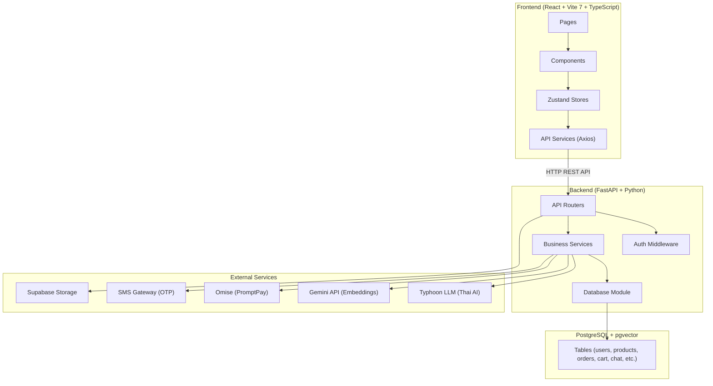

---

## 2. Frontend Routes & Page Flow

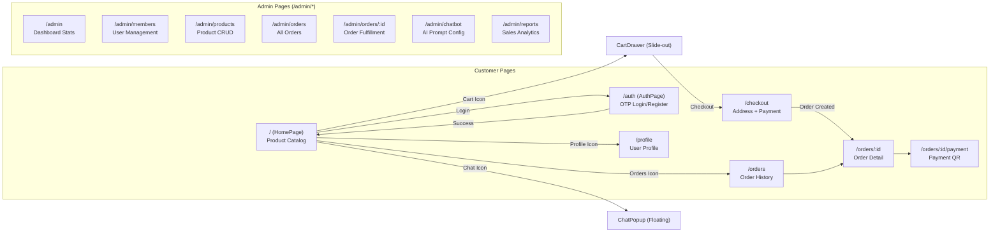

---

## 3. Authentication Flow (OTP-based)

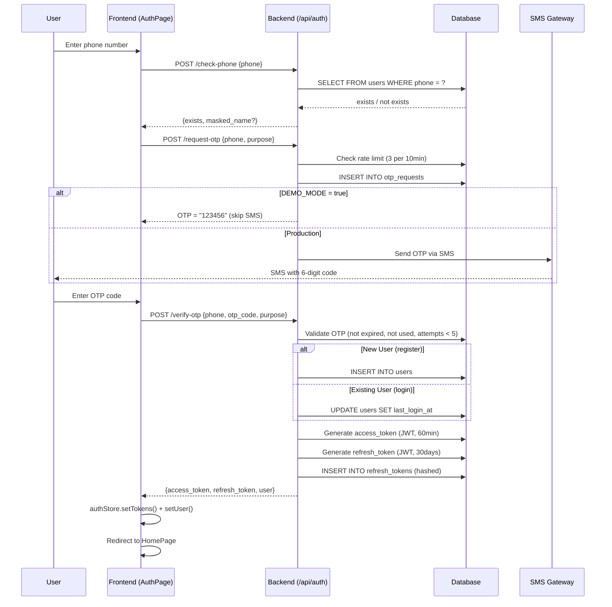

---

## 4. Token Refresh Flow

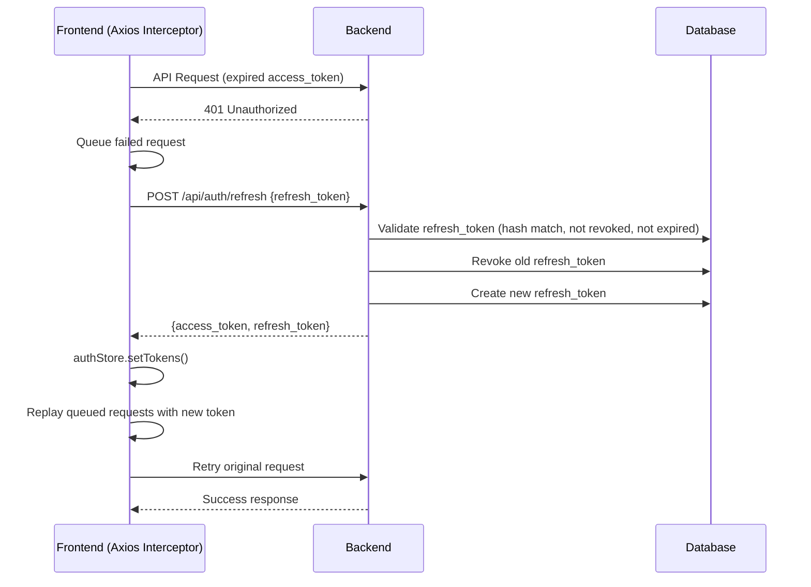

---

## 5. Product Browsing & Search Flow

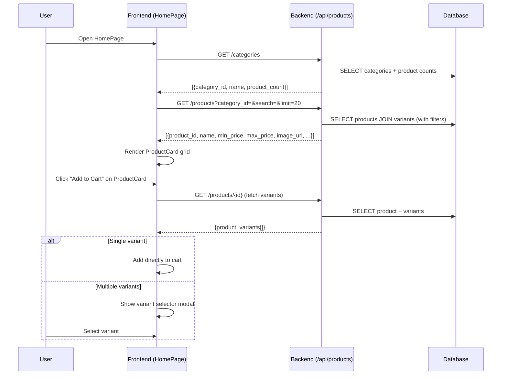

---

## 6. Cart Management Flow (Dual Mode)

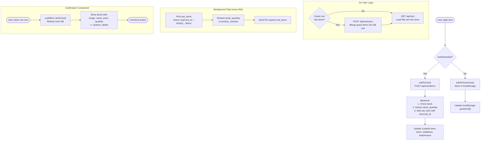

---

## 7. Checkout & Order Creation Flow

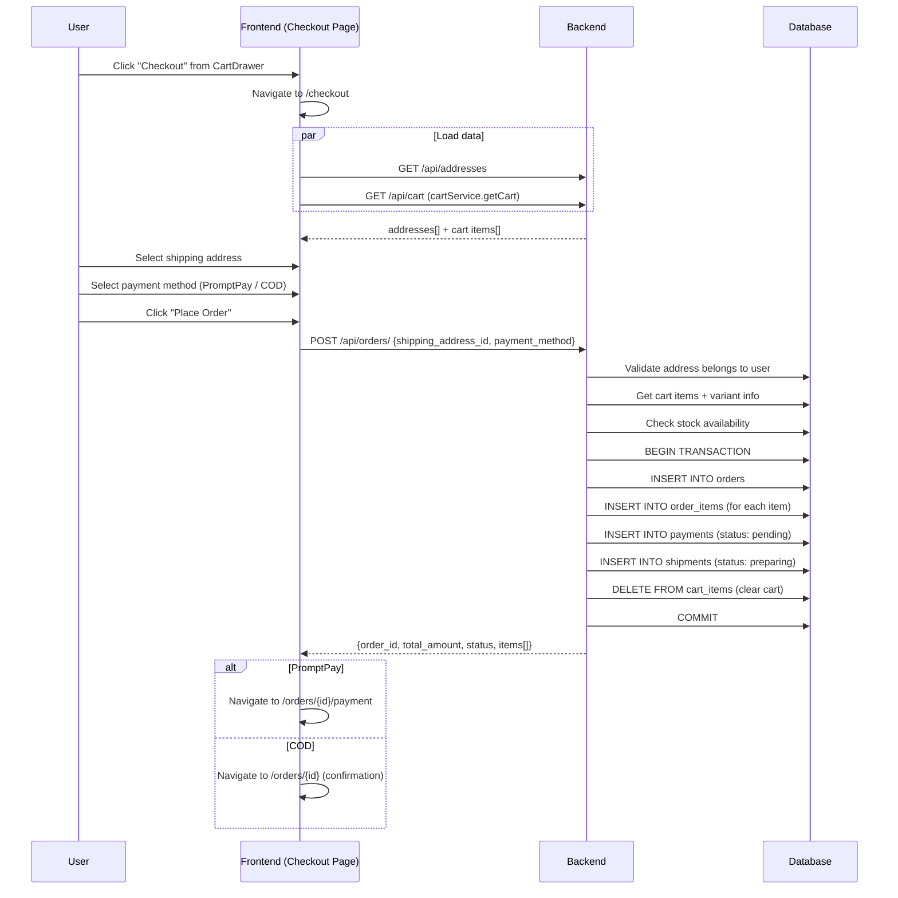

---

## 8. Payment Flow (PromptPay QR + COD)

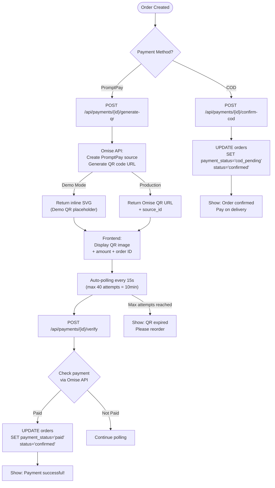

---

## 9. AI Chatbot Flow (Complete)

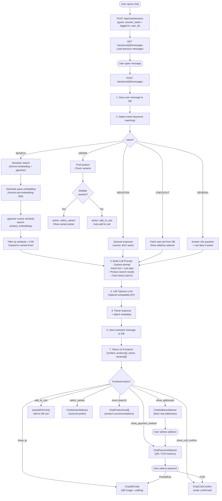

---

## 10. In-Chat Checkout Flow (Detailed)

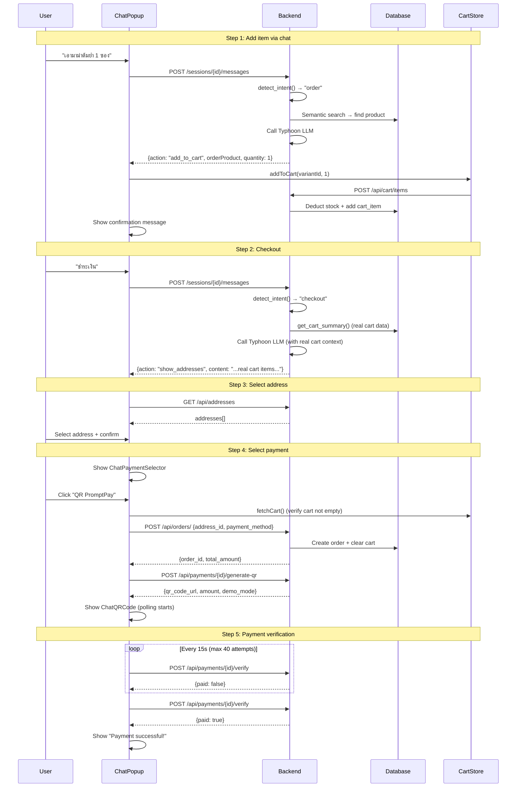

---

## 11. Admin Flow

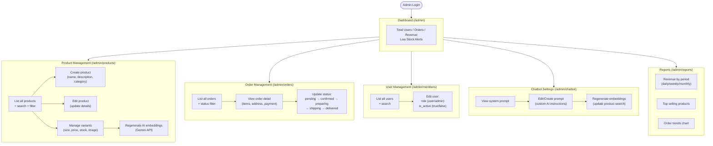

---

## 12. Database Schema (ER Diagram)

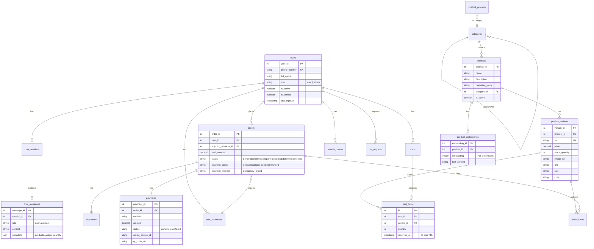

---

## 13. Component Hierarchy

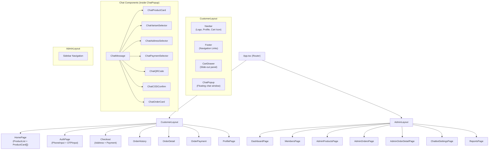

---

## 14. State Management (Zustand Stores)

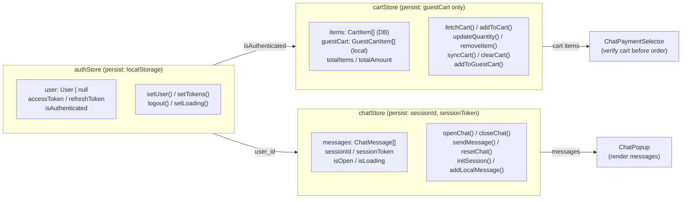
