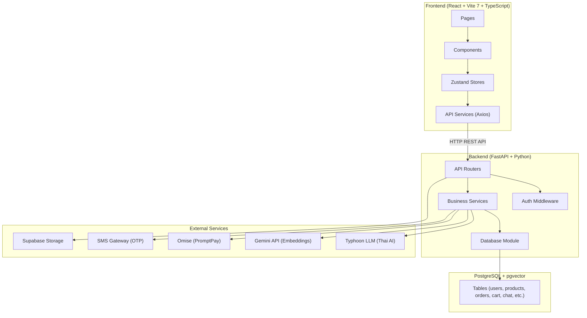

# 1. ภาพรวมระบบ (System Overview)

## ระบบ A-Commerce คืออะไร?

A-Commerce เป็นระบบร้านค้าออนไลน์สำหรับร้านสะดวกซื้อ (Convenience Store) ที่มี AI Chatbot ช่วยแนะนำสินค้าและสั่งซื้อผ่านแชทได้

---

## สถาปัตยกรรมหลัก (Architecture)

ระบบแบ่งออกเป็น 4 ส่วนหลัก:

### 1. Frontend (หน้าเว็บ)
- **เทคโนโลยี:** React + Vite 7 + TypeScript + Tailwind CSS v4
- **หน้าที่:** แสดงผลหน้าเว็บ, จัดการ UI, เชื่อมต่อกับ Backend ผ่าน REST API
- **Port:** 5174

### 2. Backend (เซิร์ฟเวอร์)
- **เทคโนโลยี:** Python + FastAPI + asyncpg
- **หน้าที่:** จัดการ Business Logic, ตรวจสอบสิทธิ์, ประมวลผลคำสั่งซื้อ
- **Port:** 8000

### 3. Database (ฐานข้อมูล)
- **เทคโนโลยี:** PostgreSQL + pgvector (บน Supabase)
- **หน้าที่:** เก็บข้อมูลผู้ใช้, สินค้า, คำสั่งซื้อ, แชท, และ AI embeddings

### 4. External Services (บริการภายนอก)
| บริการ | หน้าที่ |
|--------|---------|
| Typhoon LLM | AI สำหรับสนทนาภาษาไทย (v2.5-30b) |
| Gemini API | สร้าง Embedding สำหรับค้นหาสินค้า (text-embedding-004, 768 มิติ) |
| Omise | ระบบชำระเงินผ่าน PromptPay QR |
| SMS Gateway | ส่ง OTP สำหรับยืนยันตัวตน |
| Supabase Storage | เก็บรูปภาพสินค้า |

---

## แผนภาพระบบ

---

## การไหลของข้อมูล (Data Flow)

1. **ผู้ใช้** เปิดหน้าเว็บ (Frontend)
2. **Frontend** เรียก API ไปยัง Backend ผ่าน HTTP
3. **Backend** ตรวจสอบสิทธิ์ (JWT Token) → ประมวลผล Business Logic
4. **Backend** อ่าน/เขียนข้อมูลจาก Database
5. **Backend** เรียก External Services ตามความจำเป็น (AI, Payment, SMS)
6. **Backend** ส่งผลลัพธ์กลับไปยัง Frontend
7. **Frontend** แสดงผลให้ผู้ใช้เห็น
