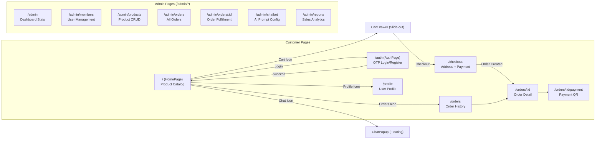

# 2. เส้นทางหน้าเว็บ (Frontend Routes)

## หน้าเว็บทั้งหมดในระบบ

ระบบแบ่งหน้าเว็บออกเป็น 2 กลุ่มหลัก: **ฝั่งลูกค้า** และ **ฝั่งแอดมิน**

---

## ฝั่งลูกค้า (Customer Pages)

| เส้นทาง (Route) | หน้า | คำอธิบาย |
|-----------------|------|----------|
| `/` | HomePage | หน้าแรก แสดงรายการสินค้าทั้งหมด |
| `/auth` | AuthPage | หน้าเข้าสู่ระบบ/สมัครสมาชิก (OTP) |
| `/checkout` | Checkout | หน้าชำระเงิน เลือกที่อยู่ + วิธีจ่าย |
| `/orders` | Order History | ประวัติคำสั่งซื้อทั้งหมด |
| `/orders/:id` | Order Detail | รายละเอียดคำสั่งซื้อแต่ละรายการ |
| `/orders/:id/payment` | Payment QR | หน้าแสดง QR Code สำหรับจ่ายเงิน |
| `/profile` | Profile | หน้าข้อมูลส่วนตัว |

### ส่วนประกอบที่แสดงตลอด (Persistent Components)
- **CartDrawer** — แถบตะกร้าสินค้าด้านขวา (เลื่อนเข้า-ออก)
- **ChatPopup** — หน้าต่างแชทลอย (มุมขวาล่าง)

---

## ฝั่งแอดมิน (Admin Pages)

| เส้นทาง (Route) | หน้า | คำอธิบาย |
|-----------------|------|----------|
| `/admin` | Dashboard | สรุปยอดขาย, จำนวนผู้ใช้, สินค้าใกล้หมด |
| `/admin/members` | Members | จัดการผู้ใช้ (เปลี่ยน role, เปิด/ปิดบัญชี) |
| `/admin/products` | Products | จัดการสินค้า (เพิ่ม/แก้ไข/ลบ + ตัวเลือกสินค้า) |
| `/admin/orders` | Orders | ดูคำสั่งซื้อทั้งหมด + อัพเดทสถานะ |
| `/admin/orders/:id` | Order Detail | รายละเอียด + จัดส่ง |
| `/admin/chatbot` | Chatbot Settings | ตั้งค่า AI Prompt + สร้าง Embeddings |
| `/admin/reports` | Reports | รายงานยอดขาย + กราฟ |

---

## การเชื่อมต่อระหว่างหน้า

---

## ขั้นตอนการใช้งานหลัก (User Journey)

1. ผู้ใช้เปิดหน้าแรก → เลือกดูสินค้า
2. กดเพิ่มสินค้าลงตะกร้า → CartDrawer แสดงรายการ
3. กด "ดำเนินการสั่งซื้อ" → ไปหน้า Checkout
4. เลือกที่อยู่จัดส่ง + วิธีชำระเงิน → สร้างคำสั่งซื้อ
5. PromptPay: แสดง QR Code → จ่ายเงิน → ยืนยันอัตโนมัติ
6. COD: ยืนยันสั่งซื้อ → ชำระเมื่อรับสินค้า

**ทางเลือก:** ผู้ใช้สามารถสั่งซื้อผ่าน ChatPopup ได้ทุกขั้นตอนเช่นกัน
