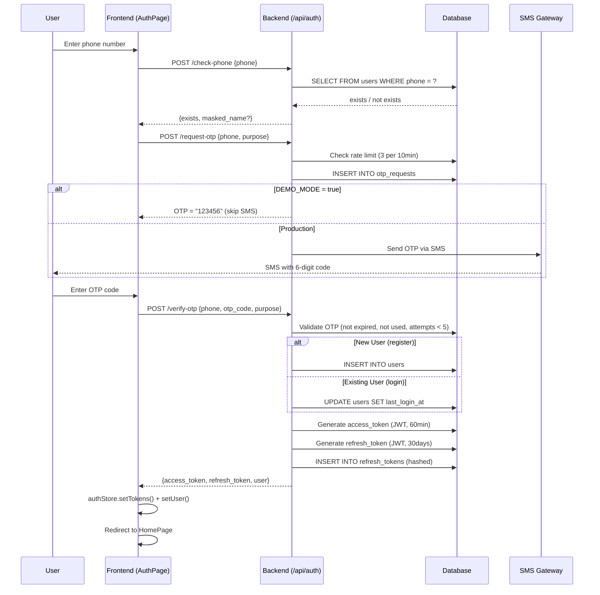
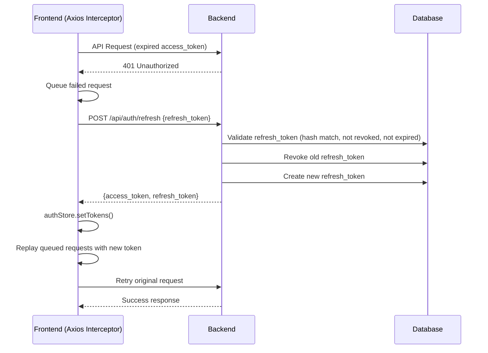

# 3. ระบบยืนยันตัวตน (Authentication)

## วิธีการเข้าสู่ระบบ

ระบบใช้ **OTP (One-Time Password)** ผ่าน SMS แทนการใช้รหัสผ่าน เพื่อความสะดวกและปลอดภัย

---

## ขั้นตอนการเข้าสู่ระบบ / สมัครสมาชิก

### ขั้นตอนที่ 1: กรอกเบอร์โทร
- ผู้ใช้กรอกเบอร์โทรศัพท์
- ระบบตรวจสอบว่าเป็นสมาชิกอยู่แล้วหรือยัง
- ถ้าเป็นสมาชิก → แสดงชื่อ (ปิดบาง) เพื่อยืนยัน

### ขั้นตอนที่ 2: ส่ง OTP
- ระบบส่งรหัส 6 หลักไปทาง SMS
- จำกัดการส่ง OTP: **สูงสุด 3 ครั้ง ต่อ 10 นาที**
- **Demo Mode:** ใช้รหัส `123456` ไม่ต้องส่ง SMS จริง

### ขั้นตอนที่ 3: ยืนยัน OTP
- ผู้ใช้กรอกรหัส OTP
- ระบบตรวจสอบ: ยังไม่หมดอายุ, ยังไม่ถูกใช้, พยายามไม่เกิน 5 ครั้ง
- **สมาชิกใหม่:** สร้างบัญชีอัตโนมัติ
- **สมาชิกเดิม:** อัพเดทเวลาเข้าสู่ระบบล่าสุด

### ขั้นตอนที่ 4: รับ Token
- ระบบสร้าง **Access Token** (JWT, อายุ 60 นาที) สำหรับเรียก API
- ระบบสร้าง **Refresh Token** (JWT, อายุ 30 วัน) สำหรับต่ออายุ
- เก็บ Token ใน localStorage ของเบราว์เซอร์

---

## แผนภาพ Authentication Flow

---

## ระบบต่ออายุ Token (Token Refresh)

เมื่อ Access Token หมดอายุ (60 นาที) ระบบจะต่ออายุอัตโนมัติโดยไม่ต้องล็อกอินใหม่

### ขั้นตอน:
1. Frontend เรียก API → ได้รับ 401 (Token หมดอายุ)
2. เก็บ Request ที่ล้มเหลวไว้ใน Queue
3. ใช้ Refresh Token ขอ Access Token ใหม่
4. ส่ง Request เดิมซ้ำพร้อม Token ใหม่

---

## ความปลอดภัย

| มาตรการ | รายละเอียด |
|---------|-----------|
| Rate Limiting | จำกัด OTP 3 ครั้ง / 10 นาที |
| OTP Attempts | กรอก OTP ผิดได้สูงสุด 5 ครั้ง |
| Token Hashing | Refresh Token เก็บเป็น Hash ใน Database |
| Token Rotation | ทุกครั้งที่ Refresh จะสร้าง Token คู่ใหม่ + ยกเลิกอันเก่า |
| Short-lived Token | Access Token อายุ 60 นาทีเท่านั้น |
