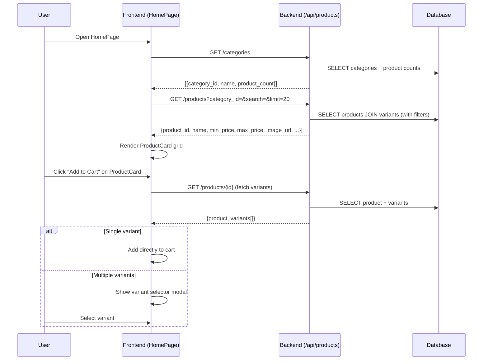

# 4. การเรียกดูและค้นหาสินค้า (Product Browsing & Search)

## ภาพรวม

ผู้ใช้สามารถเรียกดูสินค้าได้ 2 วิธี:
1. **หน้าร้านค้า (HomePage)** — เลือกหมวดหมู่ + ค้นหาข้อความ
2. **AI Chatbot** — พิมพ์สิ่งที่ต้องการ ระบบ AI ค้นหาให้อัตโนมัติ

---

## การเรียกดูสินค้าบนหน้าร้าน

### ขั้นตอน:
1. เปิดหน้าแรก → โหลดหมวดหมู่สินค้า
2. เลือกหมวดหมู่ หรือ พิมพ์ค้นหา
3. แสดงสินค้าเป็น Grid (ProductCard)
4. กดเพิ่มตะกร้า → ถ้ามีหลายขนาด แสดง Variant Selector

### API ที่ใช้:
| API | คำอธิบาย |
|-----|----------|
| `GET /api/products/categories` | โหลดรายการหมวดหมู่ |
| `GET /api/products?category_id=&search=&limit=20` | ค้นหาสินค้า |
| `GET /api/products/{id}` | โหลดรายละเอียด + ตัวเลือกสินค้า |

---

## โครงสร้างสินค้า

สินค้าแต่ละตัวมี **Variants** (ตัวเลือก) ซึ่งแยกตาม ขนาด/หน่วย/สี:

```
Product (สินค้า)
  ├── Variant 1: ขวดเล็ก 350ml - ฿15
  ├── Variant 2: ขวดกลาง 600ml - ฿20
  └── Variant 3: แพ็ค 6 ขวด - ฿100
```

ข้อมูลของ Variant:
| ฟิลด์ | คำอธิบาย |
|-------|----------|
| `sku` | รหัสสินค้า (ไม่ซ้ำกัน) |
| `price` | ราคา |
| `stock_quantity` | จำนวนสต็อก |
| `image_url` | รูปภาพ |
| `unit` | หน่วย (ขวด, กล่อง, ซอง ฯลฯ) |
| `size` | ขนาด (350ml, 1L ฯลฯ) |

---

## แผนภาพการค้นหาสินค้า



---

## การค้นหาด้วย AI (Semantic Search)

เมื่อผู้ใช้ค้นหาผ่าน Chatbot ระบบจะใช้ **Semantic Search** แทนการค้นหาข้อความธรรมดา:

1. **สร้าง Embedding:** แปลงคำค้นหาเป็นตัวเลข 768 มิติ (Gemini API)
2. **ค้นหา pgvector:** เปรียบเทียบความคล้ายกับ Embedding ของสินค้าทั้งหมด (Cosine Similarity)
3. **กรองผลลัพธ์:** เฉพาะที่มีความคล้าย > 0.55
4. **ขยายเป็น Variant:** แสดงตัวเลือกสินค้าทั้งหมดของแต่ละสินค้า

ข้อดี: ผู้ใช้พิมพ์ "น้ำอัดลม" ก็เจอ "โค้ก" "เป๊ปซี่" "แฟนต้า" ได้ แม้ไม่ได้พิมพ์ชื่อตรงๆ
