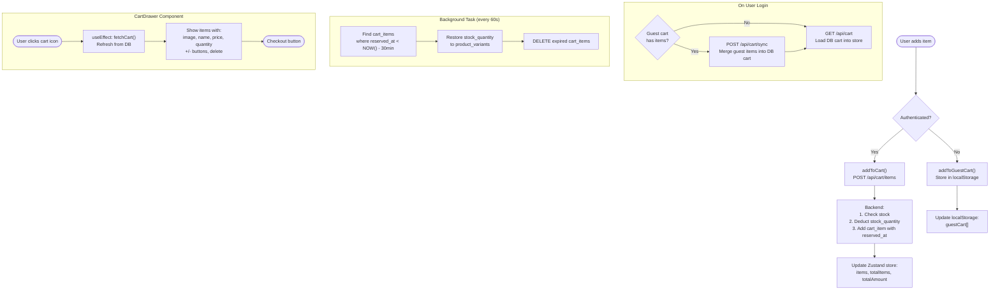

# 5. ระบบตะกร้าสินค้า (Cart Management)

## ภาพรวม

ระบบตะกร้ามี **2 โหมด** ขึ้นอยู่กับว่าผู้ใช้ล็อกอินหรือยัง:

| โหมด | เก็บที่ไหน | เมื่อไหร่ |
|------|-----------|----------|
| **Guest Cart** | localStorage ในเบราว์เซอร์ | ยังไม่ล็อกอิน |
| **DB Cart** | ฐานข้อมูล (PostgreSQL) | ล็อกอินแล้ว |

---

## การทำงานของตะกร้า

### กรณียังไม่ล็อกอิน (Guest)
- สินค้าเก็บใน localStorage
- ไม่มีการจอง Stock
- เมื่อล็อกอิน → รวม (Sync) สินค้าเข้าตะกร้าในฐานข้อมูล

### กรณีล็อกอินแล้ว (Authenticated)
- สินค้าเก็บในฐานข้อมูล
- **จอง Stock ทันที** เมื่อเพิ่มสินค้า (หัก stock_quantity)
- Stock ที่จองไว้จะ **คืนอัตโนมัติ** หลัง 30 นาที ถ้าไม่ได้สั่งซื้อ

---

## ระบบจอง Stock (Stock Reservation)

เมื่อผู้ใช้เพิ่มสินค้าลงตะกร้า:

1. ตรวจสอบ Stock → มีพอไหม?
2. **หัก stock_quantity** ออกจากสินค้า
3. สร้าง `cart_item` พร้อมบันทึก `reserved_at` (เวลาที่จอง)

### การคืน Stock อัตโนมัติ (Background Task)
ทุกๆ 60 วินาที ระบบจะ:
1. หา `cart_items` ที่ `reserved_at` เก่ากว่า 30 นาที
2. **คืน stock_quantity** กลับไปที่สินค้า
3. **ลบ** รายการที่หมดอายุออก

---

## การ Sync ตะกร้าเมื่อล็อกอิน

```
ก่อนล็อกอิน: Guest Cart มี [โค้ก x2, น้ำเปล่า x1]
                                  ↓ ล็อกอิน
หลังล็อกอิน:  DB Cart มี [โค้ก x2, น้ำเปล่า x1]
              Guest Cart ถูกล้าง
```

API: `POST /api/cart/sync` — รวมสินค้าจาก Guest เข้า DB Cart

---

## CartDrawer (แถบตะกร้าด้านขวา)

เมื่อผู้ใช้กดไอคอนตะกร้า:
1. CartDrawer เลื่อนเข้ามาจากด้านขวา
2. **ดึงข้อมูลล่าสุดจาก DB** (`fetchCart()`) ทุกครั้งที่เปิด
3. แสดงรายการสินค้า: รูป, ชื่อ, ราคา, จำนวน
4. ปุ่ม +/- เพิ่ม-ลดจำนวน, ปุ่มลบ
5. แสดงยอดรวม + ปุ่ม "ดำเนินการสั่งซื้อ"

### การ Sync ระหว่าง Chatbot กับ Cart
- สินค้าที่เพิ่มผ่าน Chatbot → เก็บลง DB Cart เหมือนกัน
- CartDrawer ดึงข้อมูลจาก DB ทุกครั้งที่เปิด → จึงเห็นสินค้าที่เพิ่มผ่าน Chatbot

---

## แผนภาพ


