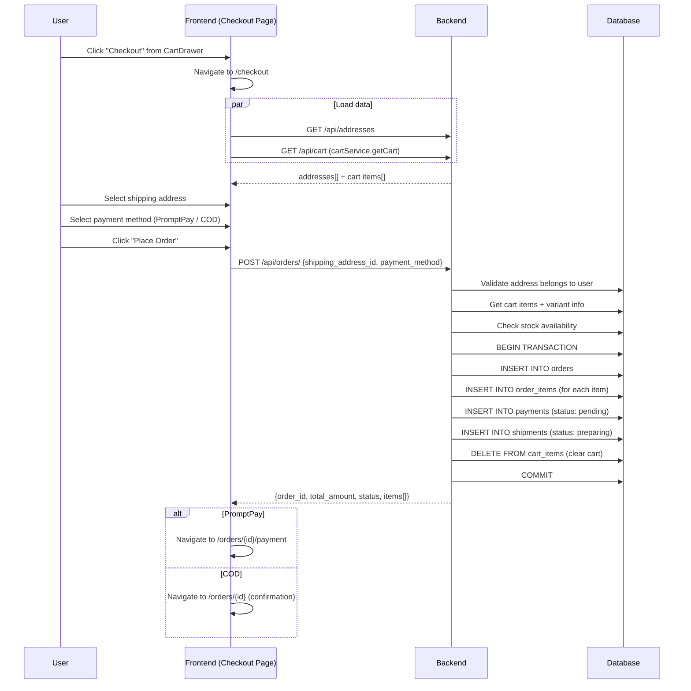

# 6. ระบบสั่งซื้อสินค้า (Checkout & Order Creation)

## ภาพรวม

ผู้ใช้สามารถสั่งซื้อได้ 2 ช่องทาง:
1. **หน้า Checkout** — ผ่านตะกร้าสินค้า → กด "ดำเนินการสั่งซื้อ"
2. **Chatbot** — พิมพ์ "ชำระเงิน" ในแชท → ดำเนินการทุกอย่างในแชท

---

## ขั้นตอนการสั่งซื้อ (ผ่านหน้า Checkout)

### 1. เตรียมข้อมูล
- โหลดที่อยู่จัดส่งของผู้ใช้
- โหลดรายการสินค้าจากตะกร้า

### 2. เลือกตัวเลือก
- เลือกที่อยู่จัดส่ง (หรือเพิ่มใหม่)
- เลือกวิธีชำระเงิน: **PromptPay QR** หรือ **เก็บเงินปลายทาง (COD)**

### 3. สร้างคำสั่งซื้อ
ระบบดำเนินการภายใน Transaction เดียว:
1. ตรวจสอบที่อยู่เป็นของผู้ใช้
2. ดึงสินค้าจากตะกร้า + ตรวจสอบสต็อก
3. สร้าง `order` (คำสั่งซื้อ)
4. สร้าง `order_items` (รายการสินค้า)
5. สร้าง `payment` (การชำระเงิน - สถานะ: pending)
6. สร้าง `shipment` (การจัดส่ง - สถานะ: preparing)
7. **ล้างตะกร้า** (ลบ cart_items ทั้งหมด)

### 4. หลังสร้างคำสั่งซื้อ
| วิธีชำระ | ไปหน้า | ขั้นตอนถัดไป |
|---------|--------|------------|
| PromptPay | `/orders/{id}/payment` | แสดง QR Code |
| COD | `/orders/{id}` | ยืนยันคำสั่งซื้อ |

---

## สถานะคำสั่งซื้อ (Order Status)

```
pending → confirmed → preparing → shipping → delivered
    ↓
cancelled
```

| สถานะ | ความหมาย |
|-------|----------|
| `pending` | รอยืนยัน (เพิ่งสร้าง) |
| `confirmed` | ยืนยันแล้ว (ชำระเงินแล้ว หรือ COD) |
| `preparing` | กำลังเตรียมสินค้า |
| `shipping` | กำลังจัดส่ง |
| `delivered` | จัดส่งสำเร็จ |
| `cancelled` | ยกเลิก |

---

## สถานะการชำระเงิน (Payment Status)

| สถานะ | ความหมาย |
|-------|----------|
| `unpaid` | ยังไม่ชำระ |
| `paid` | ชำระแล้ว |
| `cod_pending` | รอเก็บเงินปลายทาง |
| `refunded` | คืนเงินแล้ว |

---

## แผนภาพ


