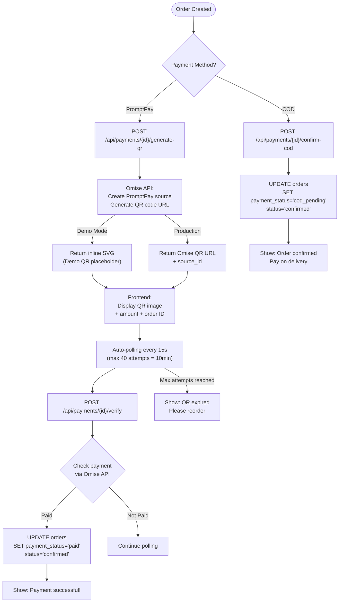

# 7. ระบบชำระเงิน (Payment Flow)

## วิธีชำระเงินที่รองรับ

| วิธี | คำอธิบาย | สถานะหลังสั่ง |
|------|----------|-------------|
| **PromptPay QR** | สแกน QR Code จ่ายเงินผ่านแอปธนาคาร | `unpaid` → `paid` |
| **COD (เก็บเงินปลายทาง)** | จ่ายเมื่อรับสินค้า | `cod_pending` |

---

## PromptPay QR Flow

### ขั้นตอน:

1. **สร้าง QR Code**
   - Frontend เรียก `POST /api/payments/{id}/generate-qr`
   - Backend สร้าง Payment Source ผ่าน Omise API
   - ได้รับ QR Code URL กลับมา

2. **แสดง QR Code**
   - แสดงภาพ QR Code + ยอดเงิน + หมายเลขออเดอร์
   - ผู้ใช้สแกน QR ผ่านแอปธนาคาร

3. **ตรวจสอบการชำระ (Auto-Polling)**
   - ระบบตรวจสอบสถานะทุก 15 วินาที
   - สูงสุด 40 ครั้ง (= 10 นาที)
   - เรียก `POST /api/payments/{id}/verify`

4. **ผลลัพธ์**
   - **ชำระสำเร็จ:** อัพเดทสถานะ order → `confirmed`, payment → `paid`
   - **หมดเวลา (10 นาที):** แสดง "QR หมดอายุ กรุณาสั่งซื้อใหม่"

### Demo Mode
- ไม่เรียก Omise API จริง
- สร้าง QR placeholder (SVG)
- Verify จะ return `paid: true` ทันที

---

## COD (เก็บเงินปลายทาง) Flow

### ขั้นตอน:
1. ผู้ใช้เลือก "เก็บเงินปลายทาง"
2. สร้างคำสั่งซื้อ → สถานะ `pending`
3. เรียก `POST /api/payments/{id}/confirm-cod`
4. อัพเดทสถานะ: order → `confirmed`, payment → `cod_pending`
5. แสดง "สั่งซื้อสำเร็จ ชำระเงินเมื่อรับสินค้า"

---

## แผนภาพ

---

## API Endpoints

| Method | URL | คำอธิบาย |
|--------|-----|----------|
| POST | `/api/payments/{id}/generate-qr` | สร้าง QR Code (Omise/Demo) |
| POST | `/api/payments/{id}/verify` | ตรวจสอบสถานะการชำระ |
| POST | `/api/payments/{id}/confirm-cod` | ยืนยัน COD |
