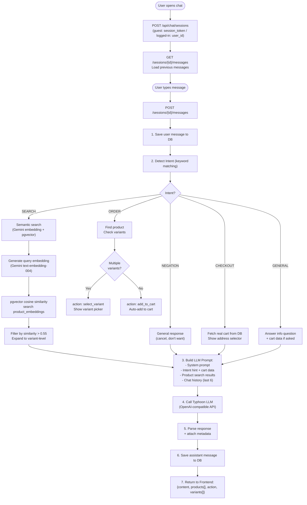

# 8. ระบบ AI Chatbot

## ภาพรวม

AI Chatbot ช่วยผู้ใช้ค้นหาสินค้า, เพิ่มตะกร้า, และสั่งซื้อ ทั้งหมดผ่านการพิมพ์แชท ไม่ต้องกดปุ่มเองเลย

### เทคโนโลยีที่ใช้:
| เทคโนโลยี | หน้าที่ |
|-----------|---------|
| **Typhoon LLM** (v2.5-30b) | AI สนทนาภาษาไทย |
| **Gemini text-embedding-004** | แปลงข้อความเป็นตัวเลข 768 มิติ |
| **pgvector** | ค้นหาสินค้าที่คล้ายกัน (Cosine Similarity) |

---

## Session Management

Chatbot รองรับทั้ง Guest และ User ที่ล็อกอิน:

| ผู้ใช้ | การระบุตัวตน | ข้อจำกัด |
|--------|-------------|---------|
| Guest | `session_token` (สร้างอัตโนมัติ) | ค้นหาสินค้าได้ สั่งซื้อไม่ได้ |
| Logged-in | `user_id` จาก JWT | ทำได้ทุกอย่าง |

---

## การตรวจจับเจตนา (Intent Detection)

เมื่อผู้ใช้พิมพ์ข้อความ ระบบจะวิเคราะห์ว่าต้องการทำอะไร:

| เจตนา (Intent) | ตัวอย่างข้อความ | สิ่งที่ระบบทำ |
|----------------|----------------|-------------|
| **SEARCH** | "มีน้ำดื่มอะไรบ้าง" | ค้นหาสินค้าด้วย AI + แสดง ProductCard |
| **ORDER** | "เอาโค้ก 2 ขวด" | หาสินค้า + เพิ่มตะกร้าอัตโนมัติ |
| **CHECKOUT** | "ชำระเงิน", "สั่งซื้อ" | ดึงตะกร้าจริง + เริ่ม flow สั่งซื้อ |
| **NEGATION** | "ไม่เอา", "ยกเลิก" | ตอบยืนยันการยกเลิก |
| **GENERAL** | "ร้านเปิดกี่โมง" | ตอบคำถามทั่วไป |

---

## ขั้นตอนการประมวลผลข้อความ

### 1. บันทึกข้อความผู้ใช้
เก็บลง `chat_messages` ในฐานข้อมูล

### 2. ตรวจจับเจตนา
ใช้ keyword matching ระบุว่าผู้ใช้ต้องการอะไร

### 3. ค้นหาสินค้า (ถ้าเป็น Search/Order)
- สร้าง Embedding จากข้อความ (Gemini API)
- ค้นหาด้วย pgvector (Cosine Similarity > 0.55)
- กรองเฉพาะสินค้าที่มี Stock

### 4. สร้าง Prompt สำหรับ LLM
รวมข้อมูลเข้าด้วยกัน:
- System Prompt (คำแนะนำสำหรับ AI)
- ข้อมูลสินค้าที่ค้นเจอ
- ข้อมูลตะกร้าจริงจาก DB (สำหรับ checkout/cart queries)
- ประวัติแชท 6 ข้อความล่าสุด

### 5. เรียก Typhoon LLM
ส่ง Prompt ไป → ได้คำตอบภาษาไทยกลับมา

### 6. ส่งผลลัพธ์ไป Frontend
ข้อมูลที่ส่งกลับ:
```json
{
  "content": "ข้อความตอบกลับ",
  "products": [...],     // สินค้าที่ค้นเจอ (แสดงเป็น Card)
  "action": "add_to_cart | show_addresses | show_payment_method | ...",
  "variants": [...],     // ตัวเลือกสินค้า (ถ้ามีหลายขนาด)
  "orderProduct": {...}  // สินค้าที่จะเพิ่มตะกร้า
}
```

---

## Action ที่ Frontend รองรับ

| Action | Component | คำอธิบาย |
|--------|-----------|----------|
| `add_to_cart` | (auto) | เพิ่มสินค้าลงตะกร้าอัตโนมัติ |
| `select_variant` | ChatVariantSelector | แสดงตัวเลือกขนาด/หน่วย |
| `show_addresses` | ChatAddressSelector | แสดงรายการที่อยู่ |
| `show_payment_method` | ChatPaymentSelector | เลือก PromptPay / COD |
| `show_qr` | ChatQRCode | แสดง QR Code + polling |
| `show_cod_confirm` | ChatCODConfirm | ยืนยัน COD สำเร็จ |
| (ไม่มี action) | ChatProductCard[] | แสดงการ์ดสินค้าแนะนำ |

---

## แผนภาพ



---

## ข้อมูลตะกร้าจริง (Cart Context)

เมื่อผู้ใช้ถามเกี่ยวกับตะกร้าหรือต้องการ Checkout ระบบจะ:
1. **ดึงตะกร้าจริงจาก DB** (ไม่ใช้ข้อมูลจากความจำ AI)
2. **ฉีดเข้าไปใน Prompt** ให้ AI รู้ว่าในตะกร้ามีอะไรจริงๆ
3. AI จะตอบตามข้อมูลจริง ไม่แต่งขึ้นเอง

ตัวอย่าง Context ที่ฉีด:
```
[ข้อมูลตะกร้าจริงจากระบบ (ห้ามแต่งเพิ่ม ให้ใช้ข้อมูลนี้เท่านั้น):
- โค้ก (ขวด 600ml) x2 = 40 บาท
- น้ำเปล่า x1 = 10 บาท
รวมยอด: 50 บาท]
```
