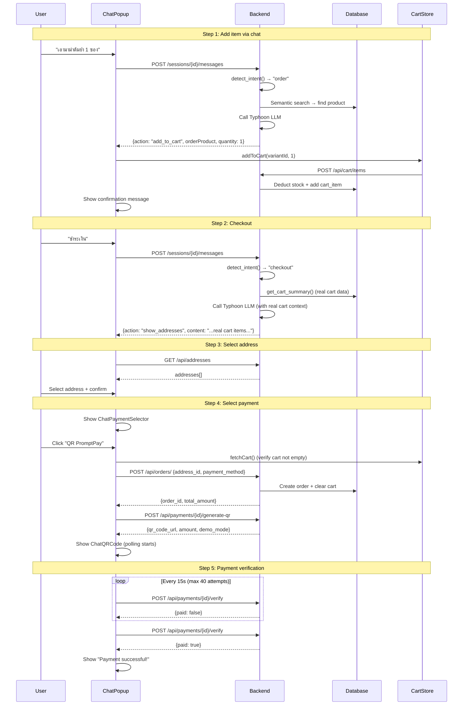

# 9. การสั่งซื้อผ่าน Chatbot (In-Chat Checkout)

## ภาพรวม

ผู้ใช้สามารถสั่งซื้อสินค้าครบทุกขั้นตอนผ่าน Chatbot โดยไม่ต้องออกจากหน้าต่างแชทเลย

---

## ขั้นตอนทั้งหมด

### ขั้นตอนที่ 1: เพิ่มสินค้าผ่านแชท

ผู้ใช้พิมพ์: `"เอามาม่าต้มยำ 1 ซอง"`

1. ระบบค้นหาสินค้า "มาม่าต้มยำ"
2. เจอสินค้า → ตรวจสอบ Variant
   - **มี 1 ขนาด:** เพิ่มตะกร้าอัตโนมัติ
   - **มีหลายขนาด:** แสดง ChatVariantSelector ให้เลือก
3. เพิ่มลงตะกร้าใน DB (จอง Stock ทันที)
4. แสดงข้อความ "เพิ่มลงตะกร้าแล้วค่ะ"

---

### ขั้นตอนที่ 2: เริ่ม Checkout

ผู้ใช้พิมพ์: `"ชำระเงิน"`

1. ระบบดึงข้อมูลตะกร้าจริงจาก DB
2. แสดงรายการสินค้าที่มีจริง + ยอดรวม
3. แสดง **ChatAddressSelector** — รายการที่อยู่จัดส่ง

---

### ขั้นตอนที่ 3: เลือกที่อยู่

1. ระบบโหลดที่อยู่จาก API
2. ผู้ใช้เลือกที่อยู่ + กด "ยืนยัน"
3. แสดง **ChatPaymentSelector** — เลือกวิธีชำระเงิน

---

### ขั้นตอนที่ 4: เลือกวิธีชำระเงิน

ผู้ใช้เลือก 1 ใน 2 วิธี:

#### PromptPay QR:
1. ตรวจสอบตะกร้าว่ามีสินค้า (ป้องกันตะกร้าว่าง)
2. สร้างคำสั่งซื้อ (`POST /api/orders/`)
3. สร้าง QR Code (`POST /api/payments/{id}/generate-qr`)
4. แสดง **ChatQRCode** — QR + polling ทุก 15 วินาที

#### COD (เก็บเงินปลายทาง):
1. ตรวจสอบตะกร้า
2. สร้างคำสั่งซื้อ
3. ยืนยัน COD (`POST /api/payments/{id}/confirm-cod`)
4. แสดง **ChatCODConfirm** — "สั่งซื้อสำเร็จ"

---

### ขั้นตอนที่ 5: ยืนยันการชำระ (PromptPay)

1. Polling ทุก 15 วินาที (สูงสุด 40 ครั้ง = 10 นาที)
2. **สำเร็จ:** แสดง "ชำระเงินสำเร็จ!" + ลิงก์ดูออเดอร์
3. **หมดเวลา:** แสดง "QR หมดอายุ กรุณาสั่งซื้อใหม่"

---

## แผนภาพ

---

## การป้องกัน Bug ที่ใส่ไว้

| การป้องกัน | คำอธิบาย |
|-----------|----------|
| **ตรวจตะกร้าก่อนสั่ง** | fetchCart() จาก DB ก่อน createOrder ป้องกัน "ตะกร้าว่าง" |
| **ข้อมูลตะกร้าจริง** | ดึงจาก DB ไม่ใช่จากความจำ AI (ป้องกัน AI แต่งข้อมูล) |
| **isLatest guard** | ปุ่มเก่าใน history ถูก disable ไม่ให้กดซ้ำ |
| **Double-click protection** | ปุ่มถูก disable ระหว่างโหลด ป้องกันกดซ้ำ |
| **QR max attempts** | หยุด polling หลัง 10 นาที ไม่ poll ตลอดไป |
