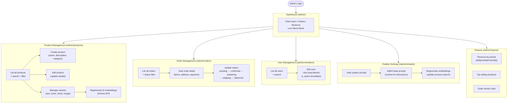

# 10. ระบบแอดมิน (Admin Panel)

## ภาพรวม

แอดมินสามารถจัดการร้านค้าทั้งหมดผ่านหน้าเว็บ `/admin/*` ซึ่งต้องล็อกอินด้วยบัญชีที่มี role = `admin`

---

## หน้าแอดมินทั้งหมด

### 1. Dashboard (`/admin`)
หน้าแรกของแอดมิน แสดงข้อมูลสรุป:
- จำนวนผู้ใช้ทั้งหมด
- จำนวนคำสั่งซื้อ
- ยอดรายได้
- สินค้าที่ใกล้หมด Stock (Low Stock Alerts)

---

### 2. จัดการสินค้า (`/admin/products`)

| ฟีเจอร์ | คำอธิบาย |
|---------|----------|
| ดูรายการ | แสดงสินค้าทั้งหมด + ค้นหา + กรองหมวด |
| เพิ่มสินค้า | กรอกชื่อ, คำอธิบาย, หมวดหมู่ |
| แก้ไขสินค้า | อัพเดทรายละเอียด |
| จัดการ Variant | เพิ่ม/แก้ไขขนาด, ราคา, Stock, รูปภาพ |
| สร้าง AI Embedding | กดปุ่มสร้าง Embedding สำหรับค้นหาด้วย AI |

**สำคัญ:** หลังเพิ่ม/แก้ไขสินค้า ต้อง **สร้าง Embedding ใหม่** เพื่อให้ Chatbot ค้นเจอสินค้านั้นๆ

---

### 3. จัดการคำสั่งซื้อ (`/admin/orders`)

| ฟีเจอร์ | คำอธิบาย |
|---------|----------|
| ดูรายการ | คำสั่งซื้อทั้งหมด + กรองตามสถานะ |
| ดูรายละเอียด | สินค้า, ที่อยู่, การชำระเงิน |
| อัพเดทสถานะ | `pending → confirmed → preparing → shipping → delivered` |

---

### 4. จัดการสมาชิก (`/admin/members`)

| ฟีเจอร์ | คำอธิบาย |
|---------|----------|
| ดูรายการ | สมาชิกทั้งหมด + ค้นหา |
| เปลี่ยน Role | `user` ↔ `admin` |
| เปิด/ปิดบัญชี | `is_active` true/false |

---

### 5. ตั้งค่า Chatbot (`/admin/chatbot`)

| ฟีเจอร์ | คำอธิบาย |
|---------|----------|
| ดู System Prompt | ดูคำสั่งที่ใช้กำกับ AI |
| แก้ไข Prompt | ปรับแต่งพฤติกรรม AI (น้ำเสียง, การตอบ) |
| สร้าง Embedding | อัพเดทข้อมูล AI สำหรับค้นหาสินค้า |

---

### 6. รายงาน (`/admin/reports`)

| ฟีเจอร์ | คำอธิบาย |
|---------|----------|
| ยอดขายตามช่วงเวลา | รายวัน / รายสัปดาห์ / รายเดือน |
| สินค้าขายดี | Top selling products |
| แนวโน้มคำสั่งซื้อ | กราฟแสดง Order Trends |

---

## แผนภาพ

