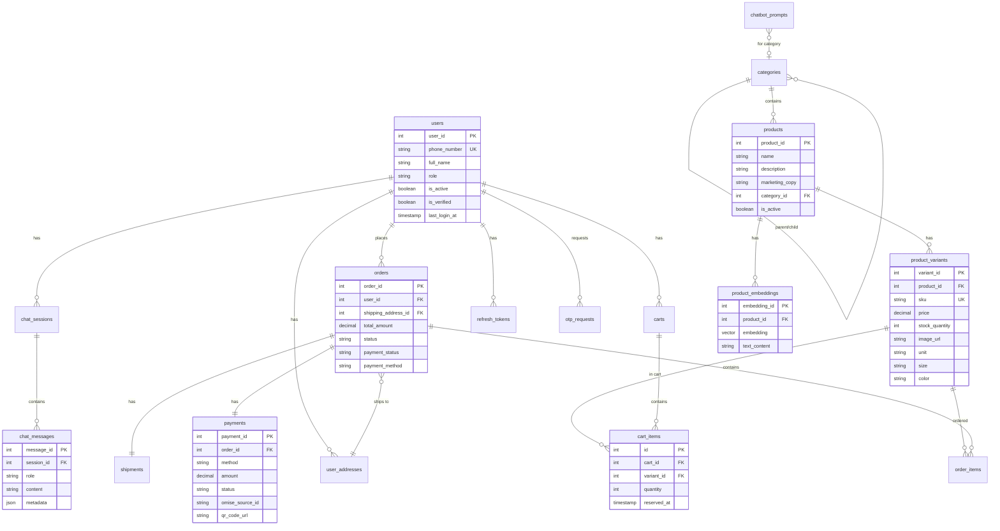

# 11. โครงสร้างฐานข้อมูล (Database Schema)

## ภาพรวม

ฐานข้อมูลใช้ **PostgreSQL** บน **Supabase** พร้อม extension **pgvector** สำหรับ AI Search

---

## ตารางทั้งหมด

### 1. users — ข้อมูลผู้ใช้
| คอลัมน์ | ชนิด | คำอธิบาย |
|---------|------|----------|
| `user_id` | INT (PK) | รหัสผู้ใช้ |
| `phone_number` | VARCHAR (UK) | เบอร์โทร (ไม่ซ้ำ) |
| `full_name` | VARCHAR | ชื่อ-นามสกุล |
| `role` | VARCHAR | สิทธิ์: `user` หรือ `admin` |
| `is_active` | BOOLEAN | เปิด/ปิดบัญชี |
| `is_verified` | BOOLEAN | ยืนยัน OTP แล้ว |
| `last_login_at` | TIMESTAMP | เข้าสู่ระบบล่าสุด |

---

### 2. products — ข้อมูลสินค้า
| คอลัมน์ | ชนิด | คำอธิบาย |
|---------|------|----------|
| `product_id` | INT (PK) | รหัสสินค้า |
| `name` | VARCHAR | ชื่อสินค้า |
| `description` | TEXT | รายละเอียด |
| `marketing_copy` | TEXT | ข้อความโปรโมท (สำหรับ AI) |
| `category_id` | INT (FK) | หมวดหมู่ |
| `is_active` | BOOLEAN | เปิด/ปิดการขาย |

---

### 3. product_variants — ตัวเลือกสินค้า
| คอลัมน์ | ชนิด | คำอธิบาย |
|---------|------|----------|
| `variant_id` | INT (PK) | รหัสตัวเลือก |
| `product_id` | INT (FK) | สินค้าที่เป็นเจ้าของ |
| `sku` | VARCHAR (UK) | รหัส SKU (ไม่ซ้ำ) |
| `price` | DECIMAL | ราคา |
| `stock_quantity` | INT | จำนวนสต็อก |
| `image_url` | VARCHAR | URL รูปภาพ |
| `unit` | VARCHAR | หน่วย (ขวด, ซอง, กล่อง) |
| `size` | VARCHAR | ขนาด (350ml, 1L) |
| `color` | VARCHAR | สี (ถ้ามี) |

---

### 4. product_embeddings — AI Embedding สำหรับค้นหา
| คอลัมน์ | ชนิด | คำอธิบาย |
|---------|------|----------|
| `embedding_id` | INT (PK) | รหัส |
| `product_id` | INT (FK) | สินค้า |
| `embedding` | VECTOR(768) | ตัวเลข 768 มิติ (Gemini) |
| `text_content` | TEXT | ข้อความที่ใช้สร้าง Embedding |

---

### 5. carts + cart_items — ตะกร้าสินค้า
**carts:**
| คอลัมน์ | คำอธิบาย |
|---------|----------|
| `cart_id` | รหัสตะกร้า |
| `user_id` | เจ้าของตะกร้า |

**cart_items:**
| คอลัมน์ | คำอธิบาย |
|---------|----------|
| `id` | รหัสรายการ |
| `cart_id` | ตะกร้า |
| `variant_id` | ตัวเลือกสินค้า |
| `quantity` | จำนวน |
| `reserved_at` | เวลาที่จอง Stock (TTL 30 นาที) |

---

### 6. orders + order_items — คำสั่งซื้อ
**orders:**
| คอลัมน์ | คำอธิบาย |
|---------|----------|
| `order_id` | รหัสคำสั่งซื้อ |
| `user_id` | ผู้สั่ง |
| `shipping_address_id` | ที่อยู่จัดส่ง |
| `total_amount` | ยอดรวม |
| `status` | สถานะ: pending/confirmed/preparing/shipping/delivered/cancelled |
| `payment_status` | สถานะชำระ: unpaid/paid/cod_pending/refunded |
| `payment_method` | วิธีชำระ: promptpay_qr/cod |

---

### 7. payments — ข้อมูลการชำระเงิน
| คอลัมน์ | คำอธิบาย |
|---------|----------|
| `payment_id` | รหัส |
| `order_id` | คำสั่งซื้อ |
| `method` | วิธีชำระ |
| `amount` | จำนวนเงิน |
| `status` | สถานะ: pending/paid/failed |
| `omise_source_id` | รหัสจาก Omise |
| `qr_code_url` | URL ของ QR Code |

---

### 8. chat_sessions + chat_messages — แชท
**chat_sessions:**
| คอลัมน์ | คำอธิบาย |
|---------|----------|
| `session_id` | รหัส Session |
| `user_id` | ผู้ใช้ (null = guest) |
| `session_token` | Token สำหรับ Guest |

**chat_messages:**
| คอลัมน์ | คำอธิบาย |
|---------|----------|
| `message_id` | รหัสข้อความ |
| `session_id` | Session |
| `role` | user / assistant |
| `content` | เนื้อหาข้อความ |
| `metadata` | JSON: products, action, quantity ฯลฯ |

---

## ความสัมพันธ์ (ER Diagram)

