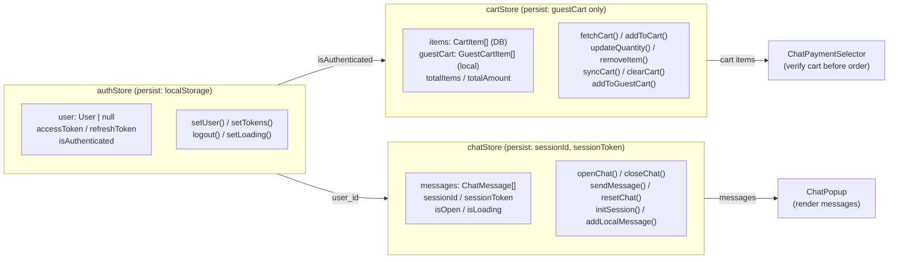
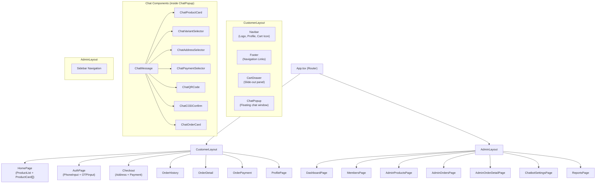

# 12. สถาปัตยกรรม Frontend (Frontend Architecture)

## ภาพรวม

Frontend สร้างด้วย **React + TypeScript + Vite 7** ใช้ **Tailwind CSS v4** สำหรับ styling และ **Zustand** สำหรับ state management

---

## โครงสร้าง Component

### Layout หลัก

```
App.tsx (Router)
  ├── CustomerLayout
  │     ├── Navbar (Logo, Profile, Cart Icon)
  │     ├── Footer (Navigation Links)
  │     ├── CartDrawer (Slide-out panel)
  │     └── ChatPopup (Floating chat window)
  │
  └── AdminLayout
        └── Sidebar Navigation
```

### หน้าลูกค้า (Customer Pages)
| Component | Route | คำอธิบาย |
|-----------|-------|----------|
| HomePage | `/` | แสดงสินค้า (ProductList + ProductCard[]) |
| AuthPage | `/auth` | ล็อกอิน (PhoneInput + OTPInput) |
| Checkout | `/checkout` | สั่งซื้อ (Address + Payment) |
| OrderHistory | `/orders` | ประวัติคำสั่งซื้อ |
| OrderDetail | `/orders/:id` | รายละเอียดคำสั่งซื้อ |
| OrderPayment | `/orders/:id/payment` | หน้าจ่ายเงิน QR |
| ProfilePage | `/profile` | ข้อมูลส่วนตัว |

### Chat Components (ภายใน ChatPopup)
| Component | คำอธิบาย |
|-----------|----------|
| ChatMessage | แสดงข้อความแต่ละบรรทัด |
| ChatProductCard | การ์ดสินค้าแนะนำ |
| ChatVariantSelector | เลือกขนาด/หน่วยสินค้า |
| ChatAddressSelector | เลือกที่อยู่จัดส่ง |
| ChatPaymentSelector | เลือกวิธีชำระเงิน |
| ChatQRCode | แสดง QR Code + polling |
| ChatCODConfirm | ยืนยัน COD สำเร็จ |
| ChatOrderCard | แสดงข้อมูลออเดอร์ |

### หน้าแอดมิน (Admin Pages)
| Component | Route | คำอธิบาย |
|-----------|-------|----------|
| DashboardPage | `/admin` | สรุปข้อมูล |
| MembersPage | `/admin/members` | จัดการสมาชิก |
| AdminProductsPage | `/admin/products` | จัดการสินค้า |
| AdminOrdersPage | `/admin/orders` | จัดการคำสั่งซื้อ |
| AdminOrderDetailPage | `/admin/orders/:id` | รายละเอียดออเดอร์ |
| ChatbotSettingsPage | `/admin/chatbot` | ตั้งค่า AI |
| ReportsPage | `/admin/reports` | รายงาน |

---

## State Management (Zustand Stores)

ระบบใช้ **Zustand** เป็น State Manager มี 3 Store หลัก:

### 1. authStore
จัดเก็บ: ข้อมูลผู้ใช้ + Token
| State | คำอธิบาย | Persist |
|-------|----------|---------|
| `user` | ข้อมูลผู้ใช้ | localStorage |
| `accessToken` | JWT Token (60 นาที) | localStorage |
| `refreshToken` | Refresh Token (30 วัน) | localStorage |
| `isAuthenticated` | สถานะล็อกอิน | localStorage |

Actions: `setUser()`, `setTokens()`, `logout()`, `setLoading()`

---

### 2. cartStore
จัดเก็บ: ตะกร้าสินค้า
| State | คำอธิบาย | Persist |
|-------|----------|---------|
| `items` | สินค้าจาก DB | ไม่ persist |
| `guestCart` | สินค้าของ Guest | localStorage |
| `totalItems` | จำนวนรายการ | ไม่ persist |
| `totalAmount` | ยอดรวม | ไม่ persist |

Actions: `fetchCart()`, `addToCart()`, `updateQuantity()`, `removeItem()`, `syncCart()`, `clearCart()`, `addToGuestCart()`

---

### 3. chatStore
จัดเก็บ: แชท AI
| State | คำอธิบาย | Persist |
|-------|----------|---------|
| `messages` | ข้อความทั้งหมด | ไม่ persist |
| `sessionId` | รหัส Session | localStorage |
| `sessionToken` | Token สำหรับ Guest | localStorage |
| `isOpen` | เปิด/ปิดแชท | ไม่ persist |
| `isLoading` | กำลังโหลด | ไม่ persist |

Actions: `openChat()`, `closeChat()`, `sendMessage()`, `resetChat()`, `initSession()`, `addLocalMessage()`

---

## ความสัมพันธ์ระหว่าง Store



---

## แผนภาพ Component ทั้งหมด


