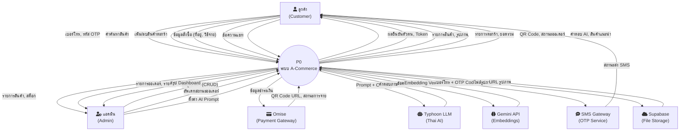

# Data Flow Diagram — Level 0 (Context Diagram)

## คำอธิบาย

Context Diagram แสดงภาพรวมของระบบ A-Commerce ทั้งหมดเป็น **1 Process** พร้อม External Entities ที่ส่งข้อมูลเข้า-ออก

---

## สัญลักษณ์ที่ใช้

| สัญลักษณ์ | ความหมาย | ในแผนภาพ |
|----------|----------|---------|
| สี่เหลี่ยม | External Entity (แหล่งข้อมูลภายนอก) | ผู้ใช้, แอดมิน, Omise, Typhoon, Gemini, SMS |
| วงกลม | Process (ระบบ) | ระบบ A-Commerce |
| ลูกศร + ชื่อ | Data Flow (ข้อมูลที่ไหล) | เบอร์โทร, OTP, สินค้า, คำสั่งซื้อ ฯลฯ |

---

## แผนภาพ

---

## รายการ Data Flow ทั้งหมด

### ลูกค้า → ระบบ (Inbound)
| # | Data Flow | คำอธิบาย |
|---|-----------|----------|
| 1 | เบอร์โทร, รหัส OTP | ข้อมูลสำหรับล็อกอิน/สมัคร |
| 2 | คำค้นหาสินค้า | ข้อความค้นหา, หมวดหมู่ |
| 3 | เพิ่ม/ลบสินค้าตะกร้า | variant_id, จำนวน |
| 4 | ข้อมูลสั่งซื้อ | ที่อยู่จัดส่ง, วิธีชำระเงิน |
| 5 | ข้อความแชท | ข้อความภาษาไทยถึง AI |

### ระบบ → ลูกค้า (Outbound)
| # | Data Flow | คำอธิบาย |
|---|-----------|----------|
| 6 | ผลยืนยันตัวตน, Token | JWT Access/Refresh Token |
| 7 | รายการสินค้า, รูปภาพ | ข้อมูลสินค้า + URL รูป |
| 8 | รายการตะกร้า, ยอดรวม | สินค้าในตะกร้า + ราคา |
| 9 | QR Code, สถานะออเดอร์ | QR สำหรับจ่ายเงิน + สถานะ |
| 10 | คำตอบ AI, สินค้าแนะนำ | ข้อความตอบ + การ์ดสินค้า |

### แอดมิน ↔ ระบบ
| # | Data Flow | คำอธิบาย |
|---|-----------|----------|
| 11 | ข้อมูลสินค้า (CRUD) | ชื่อ, ราคา, สต็อก, รูป |
| 12 | อัพเดทสถานะออเดอร์ | เปลี่ยนสถานะจัดส่ง |
| 13 | ตั้งค่า AI Prompt | System prompt สำหรับ Chatbot |
| 14 | รายงาน, Dashboard | ยอดขาย, สรุปข้อมูล |

### ระบบ ↔ บริการภายนอก
| # | Data Flow | คำอธิบาย |
|---|-----------|----------|
| 15 | ข้อมูลชำระเงิน → Omise | จำนวนเงิน, วิธีชำระ |
| 16 | QR Code URL ← Omise | URL ของ QR + สถานะ |
| 17 | Prompt + Context → Typhoon | System prompt + ข้อความ + ประวัติ |
| 18 | คำตอบภาษาไทย ← Typhoon | ข้อความตอบกลับ + metadata |
| 19 | ข้อความสินค้า → Gemini | ชื่อ + คำอธิบายสินค้า |
| 20 | Embedding Vector ← Gemini | ตัวเลข 768 มิติ |
| 21 | เบอร์โทร + OTP → SMS | ข้อมูลสำหรับส่ง SMS |
| 22 | ไฟล์รูปภาพ ↔ Supabase | อัพโหลด/ดาวน์โหลดรูป |
