# Data Flow Diagram — Level 1 (Main Processes)

## คำอธิบาย

Level 1 DFD แตก Process P0 ออกเป็น **6 Process หลัก** พร้อม **Data Stores** ที่เกี่ยวข้อง

---

## สัญลักษณ์ที่ใช้

| สัญลักษณ์ | ความหมาย | ในแผนภาพ |
|----------|----------|---------|
| สี่เหลี่ยม | External Entity | ลูกค้า, แอดมิน, Omise, Typhoon, Gemini, SMS |
| วงกลม | Process | P1-P6 |
| เส้นขนาน (แถบ) | Data Store | D1-D7 |
| ลูกศร + ชื่อ | Data Flow | ข้อมูลที่ไหลระหว่าง Process |

---

## รายการ Process

| Process | ชื่อ | คำอธิบาย |
|---------|------|----------|
| P1 | จัดการยืนยันตัวตน | OTP Login, Token, Refresh |
| P2 | จัดการสินค้า | ค้นหา, แสดงรายการ, หมวดหมู่ |
| P3 | จัดการตะกร้า | เพิ่ม/ลบสินค้า, จอง Stock, Sync |
| P4 | จัดการคำสั่งซื้อและชำระเงิน | สร้าง Order, QR, COD, Verify |
| P5 | จัดการแชท AI | สนทนา, ค้นหาสินค้า, สั่งซื้อผ่านแชท |
| P6 | จัดการระบบแอดมิน | CRUD สินค้า, จัดการออเดอร์, รายงาน |

## รายการ Data Store

| Data Store | ชื่อ | ตารางหลัก |
|------------|------|----------|
| D1 | ข้อมูลผู้ใช้ | users, user_addresses, refresh_tokens, otp_requests |
| D2 | ข้อมูลสินค้า | products, product_variants, categories |
| D3 | ข้อมูลตะกร้า | carts, cart_items |
| D4 | ข้อมูลคำสั่งซื้อ | orders, order_items, payments, shipments |
| D5 | ข้อมูลแชท | chat_sessions, chat_messages, chatbot_prompts |
| D6 | ข้อมูล AI Embedding | product_embeddings |
| D7 | ไฟล์รูปภาพ | Supabase Storage |

---

## แผนภาพ

```mermaid
graph TB
    %% External Entities
    Customer["ลูกค้า"]
    Admin["แอดมิน"]
    OmiseAPI["Omise"]
    TyphoonAPI["Typhoon LLM"]
    GeminiAPI["Gemini API"]
    SMSAPI["SMS Gateway"]

    %% Processes
    P1(("P1\nจัดการ\nยืนยันตัวตน"))
    P2(("P2\nจัดการ\nสินค้า"))
    P3(("P3\nจัดการ\nตะกร้า"))
    P4(("P4\nจัดการคำสั่งซื้อ\nและชำระเงิน"))
    P5(("P5\nจัดการ\nแชท AI"))
    P6(("P6\nจัดการระบบ\nแอดมิน"))

    %% Data Stores
    D1[("D1 ข้อมูลผู้ใช้")]
    D2[("D2 ข้อมูลสินค้า")]
    D3[("D3 ข้อมูลตะกร้า")]
    D4[("D4 ข้อมูลคำสั่งซื้อ")]
    D5[("D5 ข้อมูลแชท")]
    D6[("D6 AI Embedding")]

    %% === P1: Authentication ===
    Customer -->|"เบอร์โทร, OTP Code"| P1
    P1 -->|"Token, ข้อมูลผู้ใช้"| Customer
    P1 -->|"เบอร์โทร + OTP"| SMSAPI
    SMSAPI -->|"สถานะส่ง SMS"| P1
    P1 <-->|"อ่าน/เขียน ผู้ใช้, OTP, Token"| D1

    %% === P2: Product Browsing ===
    Customer -->|"คำค้นหา, หมวดหมู่"| P2
    P2 -->|"รายการสินค้า, รูปภาพ, ราคา"| Customer
    P2 -->|"อ่านข้อมูลสินค้า"| D2

    %% === P3: Cart ===
    Customer -->|"variant_id, จำนวน"| P3
    P3 -->|"รายการตะกร้า, ยอดรวม"| Customer
    P3 <-->|"อ่าน/เขียน ตะกร้า"| D3
    P3 -->|"หัก/คืน stock_quantity"| D2

    %% === P4: Order & Payment ===
    Customer -->|"ที่อยู่, วิธีชำระ"| P4
    P4 -->|"QR Code, สถานะออเดอร์"| Customer
    P4 <-->|"อ่าน/เขียน คำสั่งซื้อ"| D4
    P4 -->|"อ่านสินค้าจากตะกร้า"| D3
    P4 -->|"ล้างตะกร้าหลังสั่ง"| D3
    P4 -->|"ข้อมูลชำระเงิน"| OmiseAPI
    OmiseAPI -->|"QR URL, สถานะจ่าย"| P4
    P4 -->|"ตรวจสอบที่อยู่"| D1

    %% === P5: AI Chatbot ===
    Customer -->|"ข้อความแชท"| P5
    P5 -->|"คำตอบ AI, สินค้าแนะนำ, Action"| Customer
    P5 <-->|"อ่าน/เขียน ประวัติแชท"| D5
    P5 -->|"ค้นหาสินค้า (Semantic)"| D6
    P5 -->|"อ่านข้อมูลสินค้า"| D2
    P5 -->|"อ่านตะกร้าจริง"| D3
    P5 -->|"Prompt + Context"| TyphoonAPI
    TyphoonAPI -->|"คำตอบภาษาไทย"| P5
    P5 -->|"ข้อความค้นหา"| GeminiAPI
    GeminiAPI -->|"Query Embedding"| P5

    %% === P6: Admin ===
    Admin -->|"ข้อมูลสินค้า CRUD"| P6
    P6 -->|"รายการสินค้า, รายงาน"| Admin
    Admin -->|"อัพเดทสถานะออเดอร์"| P6
    P6 -->|"รายการออเดอร์"| Admin
    Admin -->|"AI Prompt, สร้าง Embedding"| P6
    P6 -->|"Dashboard สรุป"| Admin
    P6 <-->|"CRUD สินค้า + Variant"| D2
    P6 <-->|"อ่าน/อัพเดท ออเดอร์"| D4
    P6 -->|"จัดการสมาชิก"| D1
    P6 <-->|"อ่าน/เขียน Prompt"| D5
    P6 -->|"ข้อความสินค้า"| GeminiAPI
    GeminiAPI -->|"Embedding Vector"| P6
    P6 -->|"เขียน Embedding"| D6
```

---

## ตาราง Data Flow ทั้งหมด (Level 1)

### P1 — จัดการยืนยันตัวตน
| จาก | ไป | Data Flow |
|-----|-----|-----------|
| ลูกค้า | P1 | เบอร์โทร, OTP Code |
| P1 | ลูกค้า | Token (JWT), ข้อมูลผู้ใช้ |
| P1 | SMS Gateway | เบอร์โทร + OTP Code |
| SMS Gateway | P1 | สถานะส่ง SMS |
| P1 | D1 | เขียน: ผู้ใช้ใหม่, OTP, Refresh Token |
| D1 | P1 | อ่าน: ข้อมูลผู้ใช้, ตรวจ OTP, ตรวจ Token |

### P2 — จัดการสินค้า
| จาก | ไป | Data Flow |
|-----|-----|-----------|
| ลูกค้า | P2 | คำค้นหา, หมวดหมู่ที่เลือก |
| P2 | ลูกค้า | รายการสินค้า, ราคา, รูปภาพ, Variant |
| D2 | P2 | อ่าน: สินค้า, Variant, หมวดหมู่ |

### P3 — จัดการตะกร้า
| จาก | ไป | Data Flow |
|-----|-----|-----------|
| ลูกค้า | P3 | variant_id, จำนวน, คำสั่ง (เพิ่ม/ลบ/แก้ไข) |
| P3 | ลูกค้า | รายการตะกร้า, ยอดรวม, จำนวนรายการ |
| P3 | D3 | เขียน: cart_items (เพิ่ม/ลบ/แก้ไข) |
| D3 | P3 | อ่าน: รายการตะกร้า |
| P3 | D2 | หัก/คืน stock_quantity |

### P4 — จัดการคำสั่งซื้อและชำระเงิน
| จาก | ไป | Data Flow |
|-----|-----|-----------|
| ลูกค้า | P4 | ที่อยู่จัดส่ง, วิธีชำระเงิน |
| P4 | ลูกค้า | QR Code, สถานะออเดอร์, ยืนยันสั่งซื้อ |
| D3 | P4 | อ่าน: สินค้าในตะกร้า |
| P4 | D3 | ล้างตะกร้า (ลบ cart_items) |
| P4 | D4 | เขียน: order, order_items, payment, shipment |
| D4 | P4 | อ่าน: สถานะ order/payment |
| D1 | P4 | อ่าน: ที่อยู่ผู้ใช้ |
| P4 | Omise | จำนวนเงิน, วิธีชำระ |
| Omise | P4 | QR URL, source_id, สถานะจ่าย |

### P5 — จัดการแชท AI
| จาก | ไป | Data Flow |
|-----|-----|-----------|
| ลูกค้า | P5 | ข้อความแชท |
| P5 | ลูกค้า | คำตอบ AI, สินค้าแนะนำ, Action (add_to_cart ฯลฯ) |
| P5 | D5 | เขียน: ข้อความ user + assistant |
| D5 | P5 | อ่าน: ประวัติแชท, System Prompt |
| D6 | P5 | อ่าน: Product Embeddings (Semantic Search) |
| D2 | P5 | อ่าน: ข้อมูลสินค้า + Variant |
| D3 | P5 | อ่าน: ตะกร้าจริง (cart summary) |
| P5 | Typhoon | Prompt + Context + History |
| Typhoon | P5 | คำตอบภาษาไทย |
| P5 | Gemini | ข้อความค้นหา |
| Gemini | P5 | Query Embedding Vector |

### P6 — จัดการระบบแอดมิน
| จาก | ไป | Data Flow |
|-----|-----|-----------|
| แอดมิน | P6 | ข้อมูลสินค้า, สถานะออเดอร์, AI Prompt |
| P6 | แอดมิน | รายการสินค้า, ออเดอร์, รายงาน, Dashboard |
| P6 | D2 | CRUD: สินค้า + Variant |
| D2 | P6 | อ่าน: สินค้าทั้งหมด |
| P6 | D4 | อัพเดท: สถานะออเดอร์ |
| D4 | P6 | อ่าน: ออเดอร์ทั้งหมด, ยอดขาย |
| P6 | D1 | แก้ไข: role, is_active |
| D1 | P6 | อ่าน: สมาชิกทั้งหมด |
| P6 | D5 | เขียน: System Prompt |
| P6 | Gemini | ข้อความสินค้า (สำหรับ Embedding) |
| Gemini | P6 | Embedding Vector 768 มิติ |
| P6 | D6 | เขียน: Product Embeddings |
