# Data Flow Diagram — Level 2: P6 ระบบแอดมิน (Admin)

## คำอธิบาย

แตก Process P6 ออกเป็น **5 Sub-Process** แสดงรายละเอียดการจัดการร้านค้าโดยแอดมิน

---

## รายการ Sub-Process

| Process | ชื่อ | คำอธิบาย |
|---------|------|----------|
| P6.1 | แสดง Dashboard | รวมสถิติ: ผู้ใช้, ออเดอร์, รายได้, สต็อกต่ำ |
| P6.2 | จัดการสินค้า | CRUD สินค้า + Variant + สร้าง Embedding |
| P6.3 | จัดการคำสั่งซื้อ | ดูออเดอร์ + อัพเดทสถานะจัดส่ง |
| P6.4 | จัดการสมาชิก | ดูรายชื่อ + เปลี่ยน role/is_active |
| P6.5 | จัดการ AI + รายงาน | แก้ไข System Prompt + ดูรายงานยอดขาย |

---

## แผนภาพ

```mermaid
graph TB
    Admin["แอดมิน"]
    GeminiAPI["Gemini API"]
    SupabaseStorage["Supabase Storage"]

    P6_1(("P6.1\nแสดง\nDashboard"))
    P6_2(("P6.2\nจัดการ\nสินค้า"))
    P6_3(("P6.3\nจัดการ\nคำสั่งซื้อ"))
    P6_4(("P6.4\nจัดการ\nสมาชิก"))
    P6_5(("P6.5\nจัดการ AI\n+ รายงาน"))

    D1_users[("D1.1 users")]
    D2_prod[("D2.2 products")]
    D2_var[("D2.3 product_variants")]
    D2_cat[("D2.1 categories")]
    D4_orders[("D4.1 orders")]
    D4_oitems[("D4.2 order_items")]
    D4_pay[("D4.3 payments")]
    D5_prompt[("D5.3 chatbot_prompts")]
    D6_embed[("D6 product_embeddings")]
    D7_files[("D7 Supabase Storage")]

    %% P6.1: Dashboard
    Admin -->|"(เปิดหน้า Dashboard)"| P6_1
    P6_1 -->|"นับจำนวนผู้ใช้"| D1_users
    D1_users -->|"total_users"| P6_1
    P6_1 -->|"นับ/รวมยอด orders"| D4_orders
    D4_orders -->|"total_orders, total_revenue"| P6_1
    P6_1 -->|"หาสินค้า stock ต่ำ"| D2_var
    D2_var -->|"low_stock_items"| P6_1
    P6_1 -->|"สรุป: ผู้ใช้, ออเดอร์,\nรายได้, สินค้าใกล้หมด"| Admin

    %% P6.2: Product Management
    Admin -->|"ข้อมูลสินค้าใหม่/แก้ไข"| P6_2
    P6_2 -->|"INSERT/UPDATE product"| D2_prod
    D2_prod -->|"product data"| P6_2
    P6_2 -->|"INSERT/UPDATE variant"| D2_var
    D2_var -->|"variant data"| P6_2
    P6_2 -->|"อ่านหมวดหมู่"| D2_cat
    D2_cat -->|"categories[]"| P6_2
    P6_2 -->|"อัพโหลดรูปสินค้า"| SupabaseStorage
    SupabaseStorage -->|"image URL"| P6_2
    P6_2 -->|"ชื่อ + คำอธิบาย (สำหรับ Embedding)"| GeminiAPI
    GeminiAPI -->|"embedding vector (768 มิติ)"| P6_2
    P6_2 -->|"INSERT/UPDATE embedding"| D6_embed
    P6_2 -->|"รายการสินค้า, สถานะ Embedding"| Admin

    %% P6.3: Order Management
    Admin -->|"(ดูออเดอร์ / อัพเดทสถานะ)"| P6_3
    P6_3 -->|"อ่าน orders"| D4_orders
    D4_orders -->|"order list"| P6_3
    P6_3 -->|"อ่าน order items"| D4_oitems
    D4_oitems -->|"items + product info"| P6_3
    P6_3 -->|"อ่าน payment"| D4_pay
    D4_pay -->|"payment status"| P6_3
    Admin -->|"สถานะใหม่ (confirmed→\npreparing→shipping→delivered)"| P6_3
    P6_3 -->|"UPDATE order status"| D4_orders
    P6_3 -->|"รายการออเดอร์ + สถานะ"| Admin

    %% P6.4: User Management
    Admin -->|"(ดูสมาชิก / แก้ไข role)"| P6_4
    P6_4 -->|"อ่าน users"| D1_users
    D1_users -->|"user list"| P6_4
    Admin -->|"role ใหม่, is_active"| P6_4
    P6_4 -->|"UPDATE role / is_active"| D1_users
    P6_4 -->|"รายการสมาชิก"| Admin

    %% P6.5: AI Settings + Reports
    Admin -->|"System Prompt ใหม่"| P6_5
    P6_5 -->|"อ่าน/เขียน prompt"| D5_prompt
    D5_prompt -->|"prompt data"| P6_5
    P6_5 -->|"อ่านยอดขาย (รายวัน/สัปดาห์/เดือน)"| D4_orders
    D4_orders -->|"revenue by period,\ntop products, order trends"| P6_5
    P6_5 -->|"Prompt ปัจจุบัน, รายงานยอดขาย"| Admin
```

---

## ตาราง Data Flow

### P6.1 — แสดง Dashboard
| จาก | ไป | Data Flow |
|-----|-----|-----------|
| แอดมิน | P6.1 | (เปิดหน้า Dashboard) |
| P6.1 | D1.1 | COUNT users |
| P6.1 | D4.1 | COUNT orders, SUM total_amount |
| P6.1 | D2.3 | SELECT WHERE stock_quantity < threshold |
| P6.1 | แอดมิน | total_users, total_orders, total_revenue, low_stock_alerts |

### P6.2 — จัดการสินค้า
| จาก | ไป | Data Flow |
|-----|-----|-----------|
| แอดมิน | P6.2 | name, description, category_id, price, stock, image |
| P6.2 | D2.2 | INSERT/UPDATE product |
| P6.2 | D2.3 | INSERT/UPDATE variant (sku, price, stock, size, unit) |
| P6.2 | D2.1 | SELECT categories |
| P6.2 | Supabase Storage | อัพโหลดไฟล์รูป |
| Supabase Storage | P6.2 | image URL |
| P6.2 | Gemini | ข้อความสินค้า (name + description + marketing_copy) |
| Gemini | P6.2 | embedding vector 768 มิติ |
| P6.2 | D6 | INSERT/UPDATE product_embedding |
| P6.2 | แอดมิน | รายการสินค้า, สถานะ |

### P6.3 — จัดการคำสั่งซื้อ
| จาก | ไป | Data Flow |
|-----|-----|-----------|
| แอดมิน | P6.3 | status filter, order_id, สถานะใหม่ |
| P6.3 | D4.1 | SELECT orders (+ filter), UPDATE status |
| P6.3 | D4.2 | SELECT order_items |
| P6.3 | D4.3 | SELECT payment info |
| P6.3 | แอดมิน | order list, order detail, payment status |

### P6.4 — จัดการสมาชิก
| จาก | ไป | Data Flow |
|-----|-----|-----------|
| แอดมิน | P6.4 | search query, user_id, new role, new is_active |
| P6.4 | D1.1 | SELECT users (+ search), UPDATE role/is_active |
| P6.4 | แอดมิน | user list |

### P6.5 — จัดการ AI + รายงาน
| จาก | ไป | Data Flow |
|-----|-----|-----------|
| แอดมิน | P6.5 | system prompt ใหม่ |
| P6.5 | D5.3 | SELECT/INSERT/UPDATE chatbot_prompt |
| P6.5 | D4.1 | SELECT orders (group by period) |
| P6.5 | แอดมิน | current prompt, revenue report, top products, order trends |
