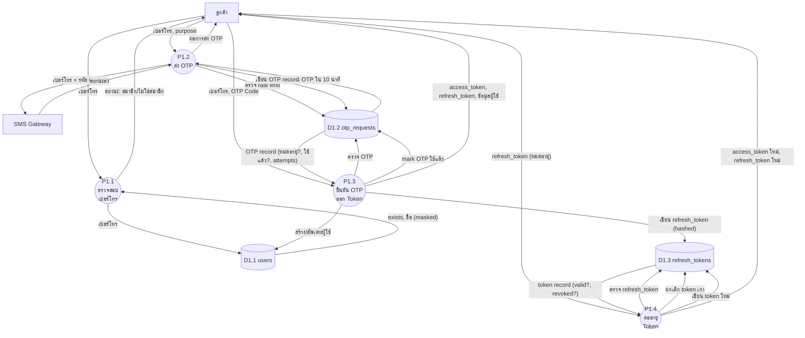

# Data Flow Diagram — Level 2: P1 จัดการยืนยันตัวตน (Authentication)

## คำอธิบาย

แตก Process P1 ออกเป็น **4 Sub-Process** แสดงรายละเอียดการล็อกอินด้วย OTP และการจัดการ Token

---

## รายการ Sub-Process

| Process | ชื่อ | คำอธิบาย |
|---------|------|----------|
| P1.1 | ตรวจสอบเบอร์โทร | ตรวจว่าเป็นสมาชิกหรือยัง |
| P1.2 | ส่ง OTP | สร้างรหัส 6 หลัก + ส่ง SMS |
| P1.3 | ยืนยัน OTP + ออก Token | ตรวจ OTP + สร้าง JWT Token |
| P1.4 | ต่ออายุ Token | ใช้ Refresh Token ขอ Token ใหม่ |

---

## แผนภาพ

---

## ตาราง Data Flow

### P1.1 — ตรวจสอบเบอร์โทร
| จาก | ไป | Data Flow |
|-----|-----|-----------|
| ลูกค้า | P1.1 | เบอร์โทร |
| P1.1 | D1.1 (users) | เบอร์โทร (query) |
| D1.1 | P1.1 | exists (bool), full_name (masked) |
| P1.1 | ลูกค้า | {exists, masked_name} |

### P1.2 — ส่ง OTP
| จาก | ไป | Data Flow |
|-----|-----|-----------|
| ลูกค้า | P1.2 | เบอร์โทร, purpose (login/register) |
| P1.2 | D1.2 (otp_requests) | ตรวจ rate limit (count ใน 10 นาที) |
| D1.2 | P1.2 | จำนวน OTP ที่ส่งแล้ว |
| P1.2 | D1.2 | INSERT otp_request (phone, code, expires_at) |
| P1.2 | SMS Gateway | เบอร์โทร + รหัส OTP 6 หลัก |
| SMS Gateway | P1.2 | สถานะส่ง (success/fail) |
| P1.2 | ลูกค้า | ผลการส่ง OTP |

### P1.3 — ยืนยัน OTP + ออก Token
| จาก | ไป | Data Flow |
|-----|-----|-----------|
| ลูกค้า | P1.3 | เบอร์โทร, OTP Code, purpose |
| P1.3 | D1.2 | ตรวจ OTP (ถูกต้อง? หมดอายุ? ใช้แล้ว?) |
| D1.2 | P1.3 | OTP record |
| P1.3 | D1.2 | UPDATE: mark used, เพิ่ม attempts |
| P1.3 | D1.1 | INSERT user ใหม่ หรือ UPDATE last_login_at |
| P1.3 | D1.3 | INSERT refresh_token (hashed) |
| P1.3 | ลูกค้า | access_token (JWT 60min), refresh_token (JWT 30d), user info |

### P1.4 — ต่ออายุ Token
| จาก | ไป | Data Flow |
|-----|-----|-----------|
| ลูกค้า | P1.4 | refresh_token |
| P1.4 | D1.3 | ตรวจ token (hash match, not revoked, not expired) |
| D1.3 | P1.4 | token record |
| P1.4 | D1.3 | UPDATE: revoke old token + INSERT new token |
| P1.4 | ลูกค้า | access_token ใหม่, refresh_token ใหม่ |
