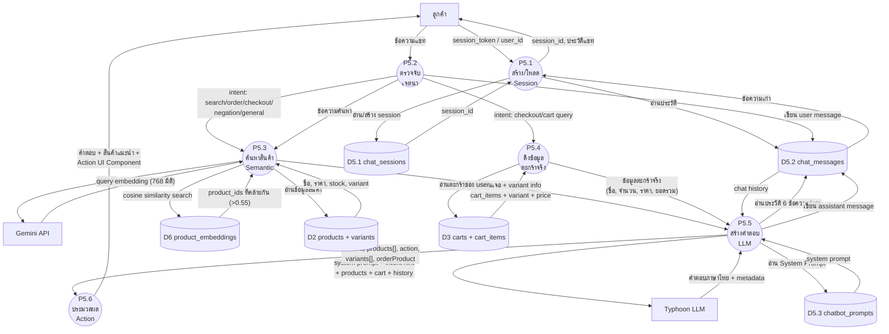

# Data Flow Diagram — Level 2: P5 แชท AI (AI Chatbot)

## คำอธิบาย

แตก Process P5 ออกเป็น **6 Sub-Process** แสดงรายละเอียดการสนทนากับ AI, การค้นหาสินค้าด้วย Semantic Search, และการสั่งซื้อผ่านแชท

---

## รายการ Sub-Process

| Process | ชื่อ | คำอธิบาย |
|---------|------|----------|
| P5.1 | สร้าง/โหลด Session | สร้าง Session ใหม่ หรือ โหลดประวัติ |
| P5.2 | ตรวจจับเจตนา | วิเคราะห์ข้อความว่าต้องการอะไร |
| P5.3 | ค้นหาสินค้า (Semantic) | แปลงข้อความเป็น Embedding + ค้นด้วย pgvector |
| P5.4 | ดึงข้อมูลตะกร้าจริง | อ่านตะกร้าจาก DB สำหรับ Checkout/Cart queries |
| P5.5 | สร้างคำตอบ (LLM) | รวม Context + เรียก Typhoon LLM |
| P5.6 | ประมวลผล Action | เพิ่มตะกร้า, แสดง UI Components |

---

## แผนภาพ

---

## ตาราง Data Flow

### P5.1 — สร้าง/โหลด Session
| จาก | ไป | Data Flow |
|-----|-----|-----------|
| ลูกค้า | P5.1 | session_token (guest) หรือ user_id (logged-in) |
| P5.1 | D5.1 (sessions) | SELECT/INSERT session |
| D5.1 | P5.1 | session_id |
| P5.1 | D5.2 (messages) | SELECT messages WHERE session_id |
| D5.2 | P5.1 | ประวัติข้อความ |
| P5.1 | ลูกค้า | session_id, messages[] |

### P5.2 — ตรวจจับเจตนา (Intent Detection)
| จาก | ไป | Data Flow |
|-----|-----|-----------|
| ลูกค้า | P5.2 | ข้อความแชท |
| P5.2 | D5.2 | INSERT user message |
| P5.2 | P5.3 | ข้อความ + intent (ถ้าเป็น search/order) |
| P5.2 | P5.4 | user_id + intent (ถ้าเป็น checkout/cart query) |

**วิธีตรวจจับ:**
| เจตนา | Keywords ที่จับ |
|--------|----------------|
| NEGATION | ไม่เอา, ไม่ต้อง, ยกเลิก |
| CHECKOUT | ชำระเงิน, สั่งซื้อ, จ่ายเงิน, เช็คเอาท์ |
| ORDER | เอา, ขอ, ต้องการ, สั่ง + ชื่อสินค้า |
| SEARCH | มีอะไร, แนะนำ, หา, ค้นหา |
| GENERAL | (ทุกอย่างที่ไม่ตรงข้างบน) |

### P5.3 — ค้นหาสินค้า (Semantic Search)
| จาก | ไป | Data Flow |
|-----|-----|-----------|
| P5.2 | P5.3 | ข้อความค้นหา |
| P5.3 | Gemini | ข้อความ (สำหรับสร้าง query embedding) |
| Gemini | P5.3 | embedding vector (768 มิติ) |
| P5.3 | D6 (embeddings) | query vector (cosine similarity search) |
| D6 | P5.3 | product_ids ที่มี similarity > 0.55 |
| P5.3 | D2 (products) | อ่านข้อมูลสินค้า + variant ตาม product_ids |
| D2 | P5.3 | name, price, stock, size, unit, image |
| P5.3 | P5.5 | สินค้าที่ค้นเจอ + variant info |

### P5.4 — ดึงข้อมูลตะกร้าจริง
| จาก | ไป | Data Flow |
|-----|-----|-----------|
| P5.2 | P5.4 | user_id |
| P5.4 | D3 (carts + items) | SELECT cart_items JOIN variants JOIN products WHERE user_id |
| D3 | P5.4 | ชื่อสินค้า, ขนาด, จำนวน, ราคา |
| P5.4 | P5.5 | ข้อความสรุปตะกร้าจริง (ห้าม AI แต่งเอง) |

### P5.5 — สร้างคำตอบ (LLM)
| จาก | ไป | Data Flow |
|-----|-----|-----------|
| P5.3 | P5.5 | สินค้าที่ค้นเจอ |
| P5.4 | P5.5 | ข้อมูลตะกร้าจริง |
| P5.5 | D5.3 (prompts) | อ่าน System Prompt |
| P5.5 | D5.2 (messages) | อ่านประวัติ 6 ข้อความล่าสุด |
| P5.5 | Typhoon | Prompt รวม: system + intent + products + cart + history |
| Typhoon | P5.5 | คำตอบภาษาไทย |
| P5.5 | D5.2 | INSERT assistant message + metadata |
| P5.5 | P5.6 | content, products[], action, variants[], orderProduct |

### P5.6 — ประมวลผล Action (Frontend)
| จาก | ไป | Data Flow |
|-----|-----|-----------|
| P5.5 | P5.6 | action type + data |
| P5.6 | ลูกค้า | UI Component ตาม action: |

**Action → Data ที่ส่งให้ลูกค้า:**
| Action | Data Flow ไปลูกค้า |
|--------|-------------------|
| add_to_cart | orderProduct (variant_id, qty) → เพิ่มตะกร้าอัตโนมัติ |
| select_variant | variants[] → แสดง Variant Selector |
| show_addresses | (trigger) → แสดง Address Selector |
| show_payment_method | address_id → แสดง Payment Selector |
| show_qr | order_id, payment_id → แสดง QR + polling |
| show_cod_confirm | order_id → แสดงยืนยัน COD |
| (ไม่มี) | products[] → แสดง Product Cards |
