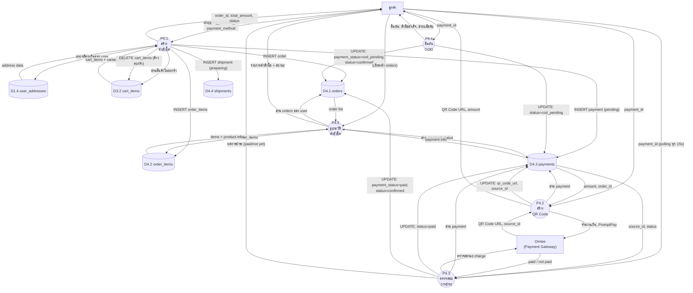

# Data Flow Diagram — Level 2: P4 คำสั่งซื้อและชำระเงิน (Order & Payment)

## คำอธิบาย

แตก Process P4 ออกเป็น **5 Sub-Process** แสดงรายละเอียดการสร้างคำสั่งซื้อ, สร้าง QR, ตรวจสอบการชำระ, และ COD

---

## รายการ Sub-Process

| Process | ชื่อ | คำอธิบาย |
|---------|------|----------|
| P4.1 | สร้างคำสั่งซื้อ | อ่านตะกร้า + สร้าง order + ล้างตะกร้า |
| P4.2 | สร้าง QR Code | เรียก Omise สร้าง PromptPay QR |
| P4.3 | ตรวจสอบการชำระ | Polling ตรวจสถานะจาก Omise |
| P4.4 | ยืนยัน COD | อัพเดทสถานะเป็น cod_pending |
| P4.5 | ดูประวัติคำสั่งซื้อ | ดึงรายการ order ของผู้ใช้ |

---

## แผนภาพ

---

## ตาราง Data Flow

### P4.1 — สร้างคำสั่งซื้อ
| จาก | ไป | Data Flow |
|-----|-----|-----------|
| ลูกค้า | P4.1 | shipping_address_id, payment_method |
| P4.1 | D1.4 (addresses) | ตรวจ address เป็นของ user |
| P4.1 | D3.2 (cart_items) | อ่านสินค้าในตะกร้า |
| P4.1 | D4.1 (orders) | INSERT: user_id, address_id, total, method |
| P4.1 | D4.2 (order_items) | INSERT: order_id, variant_id, qty, price (ต่อรายการ) |
| P4.1 | D4.3 (payments) | INSERT: order_id, method, amount, status=pending |
| P4.1 | D4.4 (shipments) | INSERT: order_id, status=preparing |
| P4.1 | D3.2 | DELETE: ล้าง cart_items ทั้งหมด |
| P4.1 | ลูกค้า | order_id, total_amount, items[], status |

### P4.2 — สร้าง QR Code (PromptPay)
| จาก | ไป | Data Flow |
|-----|-----|-----------|
| ลูกค้า | P4.2 | payment_id |
| D4.3 | P4.2 | amount, order_id |
| P4.2 | Omise | amount, type=promptpay |
| Omise | P4.2 | QR Code URL, source_id |
| P4.2 | D4.3 | UPDATE: qr_code_url, omise_source_id |
| P4.2 | ลูกค้า | QR Code URL, amount, demo_mode |

### P4.3 — ตรวจสอบการชำระ
| จาก | ไป | Data Flow |
|-----|-----|-----------|
| ลูกค้า | P4.3 | payment_id (ทุก 15 วินาที, สูงสุด 40 ครั้ง) |
| D4.3 | P4.3 | omise_source_id, current status |
| P4.3 | Omise | source_id (ตรวจสถานะ) |
| Omise | P4.3 | charge status (paid/not paid) |
| P4.3 | D4.3 | UPDATE: status=paid |
| P4.3 | D4.1 | UPDATE: payment_status=paid, status=confirmed |
| P4.3 | ลูกค้า | {paid: true/false} |

### P4.4 — ยืนยัน COD
| จาก | ไป | Data Flow |
|-----|-----|-----------|
| ลูกค้า | P4.4 | payment_id |
| P4.4 | D4.3 | UPDATE: status=cod_pending |
| P4.4 | D4.1 | UPDATE: payment_status=cod_pending, status=confirmed |
| P4.4 | ลูกค้า | ยืนยันสำเร็จ |
