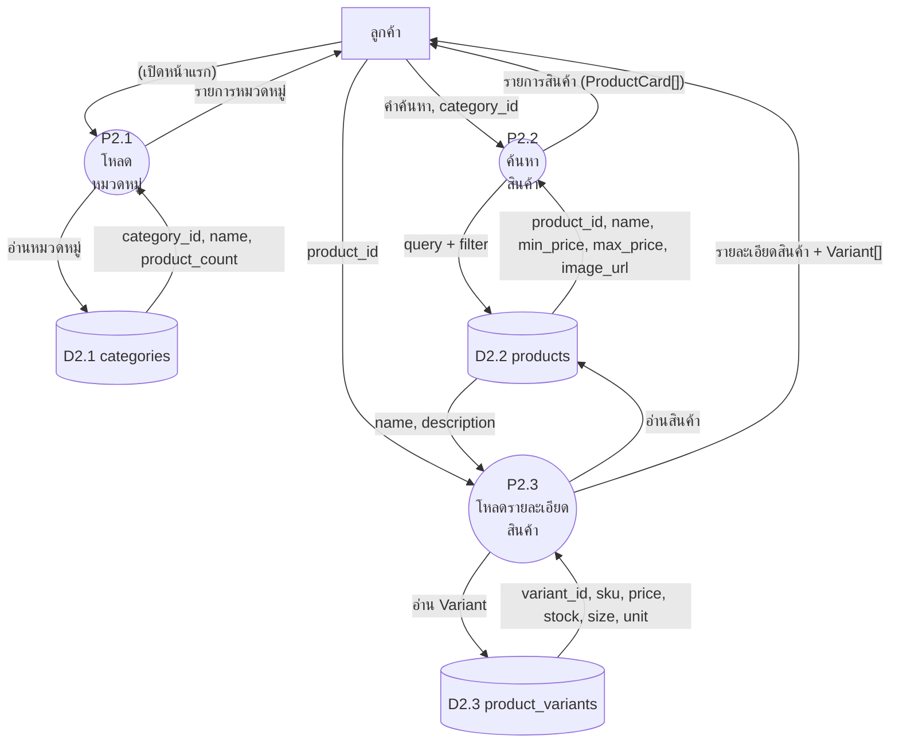
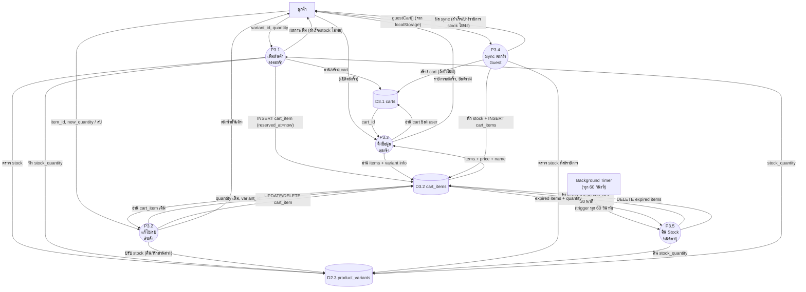

# Data Flow Diagram — Level 2: P2+P3 สินค้าและตะกร้า (Product & Cart)

## คำอธิบาย

แตก Process P2 (จัดการสินค้า) และ P3 (จัดการตะกร้า) ออกเป็น Sub-Process ย่อย

---

## รายการ Sub-Process

### P2 — จัดการสินค้า
| Process | ชื่อ | คำอธิบาย |
|---------|------|----------|
| P2.1 | โหลดหมวดหมู่ | ดึงรายการหมวดหมู่สินค้า |
| P2.2 | ค้นหาสินค้า | ค้นหาตามชื่อ/หมวดหมู่ |
| P2.3 | โหลดรายละเอียดสินค้า | ดึงข้อมูล + Variant ของสินค้า |

### P3 — จัดการตะกร้า
| Process | ชื่อ | คำอธิบาย |
|---------|------|----------|
| P3.1 | เพิ่มสินค้าลงตะกร้า | จอง Stock + สร้าง cart_item |
| P3.2 | แก้ไข/ลบสินค้าในตะกร้า | เปลี่ยนจำนวน หรือ ลบออก |
| P3.3 | ดึงข้อมูลตะกร้า | โหลดรายการ + คำนวณยอดรวม |
| P3.4 | Sync ตะกร้า Guest | รวมสินค้าจาก Guest เข้า DB |
| P3.5 | คืน Stock หมดอายุ | Background task ทุก 60 วินาที |

---

## แผนภาพ P2 — จัดการสินค้า

---

## แผนภาพ P3 — จัดการตะกร้า

---

## ตาราง Data Flow

### P3.1 — เพิ่มสินค้าลงตะกร้า
| จาก | ไป | Data Flow |
|-----|-----|-----------|
| ลูกค้า | P3.1 | variant_id, quantity |
| P3.1 | D2.3 (variants) | ตรวจ stock_quantity |
| D2.3 | P3.1 | stock_quantity ปัจจุบัน |
| P3.1 | D2.3 | UPDATE: stock_quantity -= quantity |
| P3.1 | D3.1 (carts) | อ่าน/สร้าง cart สำหรับ user |
| P3.1 | D3.2 (cart_items) | INSERT: variant_id, quantity, reserved_at |
| P3.1 | ลูกค้า | ผลการเพิ่ม (สำเร็จ / stock ไม่พอ) |

### P3.5 — คืน Stock หมดอายุ (Background)
| จาก | ไป | Data Flow |
|-----|-----|-----------|
| Timer | P3.5 | trigger ทุก 60 วินาที |
| P3.5 | D3.2 | SELECT: WHERE reserved_at < NOW() - 30min |
| D3.2 | P3.5 | expired items (variant_id, quantity) |
| P3.5 | D2.3 | UPDATE: stock_quantity += quantity (คืน stock) |
| P3.5 | D3.2 | DELETE: expired cart_items |
